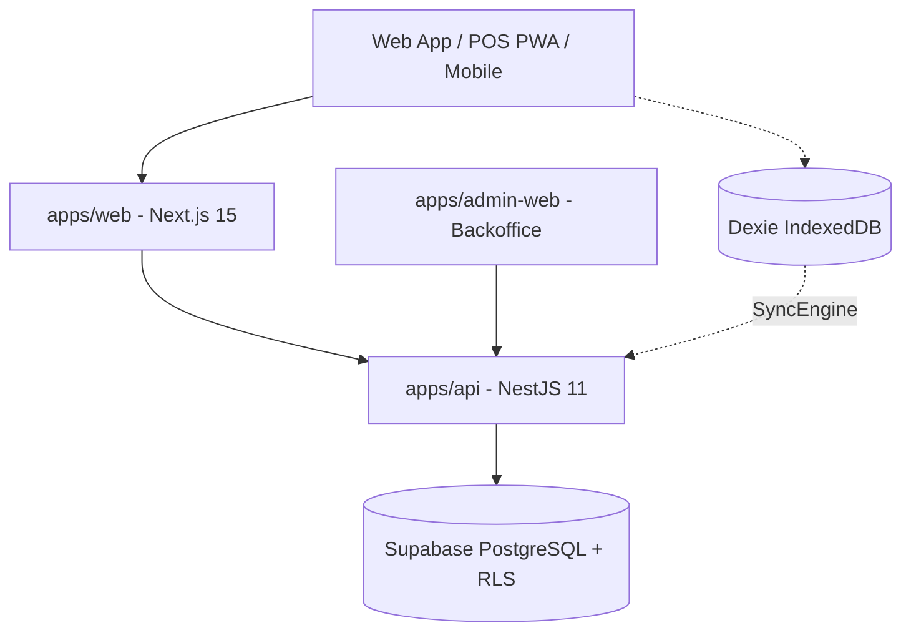

<!--
  @author @hopsyder
  @organization Nexus Partners
  @description DEXTY v2.2 — Architecture Globale Wilinwi
  @created 2026-06-19
  @updated 2026-10-04
  🌐 nexus-partners.xyz
-->

# Architecture Système — Wilinwi

## 1. Vue d'ensemble

Wilinwi est le système d'exploitation du commerce africain : un SaaS multi-tenant unifié couvrant le point de vente (POS), la gestion des stocks, la trésorerie, le CRM et carnet de dettes, les livraisons, l'entrepôt et l'analytique.



## 2. Structure du Monorepo (Turborepo + pnpm)

```text
apps/
  api/          — Backend NestJS 11 (monolithe modulaire : auth, stock, pos, crm, etc.)
  web/          — Frontend Next.js 15 (App Router) + React 19 + TailwindCSS 3
  admin-web/    — Backoffice super-admin plateforme (gestion des tenants et abonnements)
packages/
  types/        — Schémas Zod, typages partagés, rôles & capacités RBAC
  db/           — Schéma Prisma 6, migrations, scripts RLS, client multi-tenant withTenant()
  ui/           — Design system Wilinwi, composants UI partagés, tokens Tailwind
  offline/      — Schéma IndexedDB (Dexie 4), file d'attente hors-ligne & SyncEngine
.dexty/         — Moteur de mémoire d'architecture, décisions et contraintes DEXTY v2.2
```

## 3. Sécurité et Cloisonnement Multi-Tenant

1. **Isolation BDD (Row-Level Security)** :
   - Chaque table métier (sauf la table globale `Tenant`) possède une colonne `tenant_id`.
   - Les requêtes applicatives s'exécutent avec le rôle PostgreSQL `wilinwi_app` sous RLS stricte (`current_setting('app.current_tenant_id')`).
   - Côté NestJS, toute transaction passe par `PrismaService.forTenant(tenantId, async (tx) => { ... })`.

2. **Système de permissions (RBAC & Capacités)** :
   - 5 Rôles métier : `OWNER`, `MANAGER`, `SELLER`, `CASHIER`, `DELIVERY`.
   - Contrôle d'accès fin par capacités (`packages/types/src/roles.ts`) : `@RequireCapabilities(...)`.
   - Sécurité au niveau champ : `prixAchat` et `prixPlancher` ne sont jamais exposés aux caissiers ou vendeurs (filtrés via `toProductDto()`).

3. **Authentification Hybride** :
   - Sessions Web/Admin : Supabase Auth via JWKS asymétrique (`ES256`).
   - Sessions Caisse POS rapide : Code PIN collaborateur à 4 chiffres (hash bcrypt) avec JWT symétrique (`HS256`).
   - Protection anti-bruteforce : Verrouillage automatique de la caisse après échecs répétés.

## 4. Architecture des Flux Métier

### A. Flux de Vente et Caisse (POS)
- **Sessions de caisse** : Ouverture avec fond de caisse initial, suivi en temps réel des encaissements par mode (Cash, Mobile Money), clôture avec calcul d'écart et ticket Z.
- **Ventes décimales et au conditionnement** :
  - Produits au poids / volume : stock géré en milli-unités entières (1000 = 1 kg/L) avec `quantity_scale`.
  - Produits à l'unité : fractionnable jusqu'au millième avec seuil d'epsilon `1e-6`.
  - Conditionnements multiples : sélection immédiate (bouteille vs casier).
- **Système à 4 prix anti-fraude** :
  - `prixAchat <= prixPlancher <= prixCatalogue`.
  - `prixReel` négocié à la caisse rejeté si inférieur au `prixPlancher`.

### B. Mode Hors-Ligne (Offline-First)
- Encaissement immédiat stocké dans `Dexie` en local.
- Débit instantané du snapshot de stock local pour prévenir la survente.
- Synchronisation automatique dès retour du réseau avec traitement idempotent (`clientGeneratedId`).
- Centre de résolution des conflits dans la Topbar en cas de rejet serveur.

### C. Importation et Catalogue
- Assistant en 3 étapes : Chargement, Mapping, Prévisualisation & Anomalies.
- Support natif Excel (.xlsx, .xls) et CSV.
- Auto-génération de codes SKU uniques (`generateSmartSku`).
- Flexibilité d'onboarding : options « Laisser vide » pour stock, catégorie et prix d'achat.
