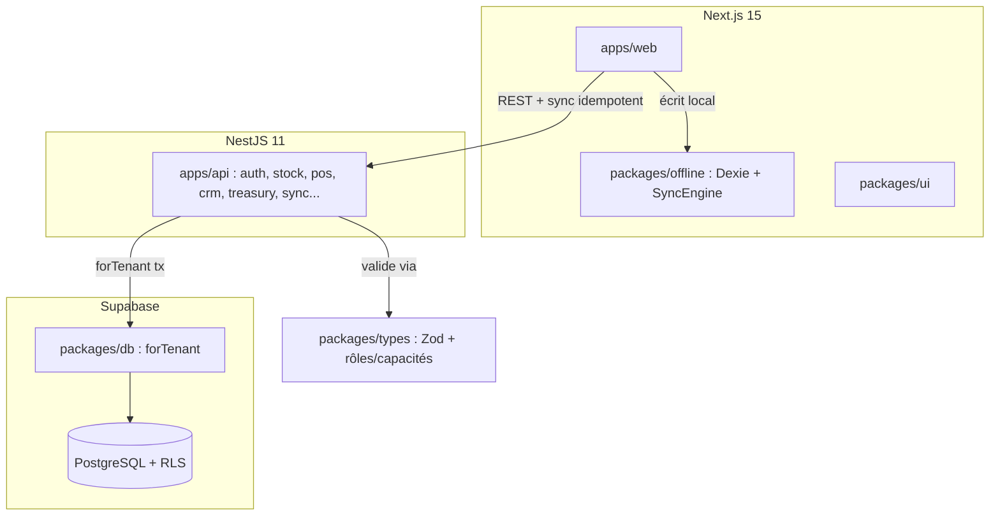

# Évaluation de l'Architecture de Wilinwi

> Analyse confrontée au code (`apps/`, `packages/`), pas seulement au cahier des
> charges. Objectif : distinguer ce qui est **déjà en place**, ce qui est un
> **vrai risque ouvert**, et ce qui relève d'une optimisation **prématurée**.

---

## 1. Architecture actuelle

Monorepo Turborepo, deux applicatifs Node + packages partagés. Une seule base
PostgreSQL (Supabase) isolée par Row-Level Security.

### Ce qui est solide (et confirmé dans le code)

- **Isolation tenant en base, pas seulement en code.** Toute opération passe par
  [`PrismaService.forTenant`](apps/api/src/common/prisma.service.ts) → ouvre une
  transaction et positionne `app.current_tenant_id` via
  [`set_config(..., true)`](packages/db/src/index.ts#L48) (local à la transaction).
  La RLS isole même si le code applicatif a un bug. C'est le bon niveau de garantie
  pour un SaaS multi-tenant.
- **Source de vérité partagée.** `packages/types` (Zod) sert de contrat
  client/serveur unique : pas de désalignement d'API.
- **Sécurité champ-par-champ réellement centralisée.** `prix_achat` masqué aux rôles
  vendeur via un point de sortie unique
  ([`toProductDto()`](apps/api/src/stock/product.mapper.ts)).
- **Offline-first abouti.** Le POS écrit en IndexedDB et synchronise via
  `POST /api/sync/sales`, idempotent par `clientGeneratedId`
  ([sales.service.ts:48-73](apps/api/src/pos/sales.service.ts#L48-L73)).
- **Authentification à double mécanisme, sans secret partagé pour le cas nominal.**
  `AuthGuard` vérifie les tokens Supabase via **JWKS distant** (ES256, rotation de clé
  native) et ne retombe sur un secret HS256 interne que pour le token PIN (poste
  partagé, jamais émis par Supabase) — voir
  [jwt-verifier.ts](apps/api/src/common/jwt-verifier.ts). Anti-bruteforce PIN
  **persistant en base** (`User.pinFailCount`/`pinLockedUntil`), pas en mémoire : ne
  se réinitialise pas à chaque redeploy et fonctionne à N instances.
- **Gating numérique par plan avec grand-père, pas un simple plafond binaire.**
  Les limites (`maxUsers`, `maxEtablissements`, `maxProducts`, `maxPhotos`) sont
  enforced serveur avec un bypass pour les tenants antérieurs à l'activation globale
  du gating (`ctx.isGrandfathered`,
  [grandfather.ts](apps/api/src/common/grandfather.ts)) — évite de casser des clients
  existants au moment d'activer la fonctionnalité. Activation globale atomique sur
  les 4 plans via `app.platform_set_gating_activated()` (SQL), plutôt qu'un champ par
  plan qui risquerait de diverger silencieusement.

### Verdict sur le choix d'architecture

Le monolithe modulaire NestJS + RLS + offline-first est **le bon choix** pour ce
produit, et il n'y a pas de raison d'en changer. Les deux alternatives souvent
évoquées sont écartées rapidement :

- **BaaS pur (Next.js ↔ Supabase direct).** Reporterait la sécurité
  champ-par-champ, l'anti-fraude prix et la logique Hub & Spoke dans des
  triggers/fonctions SQL et le client. Régression nette de maintenabilité et de
  sécurité. À écarter.
- **Event-driven (broker + workers pour le sync).** Sur-ingénierie pour l'échelle
  visée (POS offline-first → faible concurrence d'écriture, déjà bufferisée en
  local). À reconsidérer seulement au-delà de plusieurs centaines de tenants actifs.

---

## 2. Ce que le code couvre DÉJÀ (et qu'il ne faut pas « refaire »)

Deux points souvent listés comme « actions critiques » sont **déjà implémentés** —
les rappeler ici évite de rouvrir des chantiers clos.

- **Anti-fraude prix côté serveur — FAIT.** Le sync ne fait pas confiance au client.
  `createSale` re-vérifie chaque ligne contre le `prixPlancher` réel en base et
  **refuse** (`BadRequestException`) toute vente sous le plancher
  ([sales.service.ts:115-118](apps/api/src/pos/sales.service.ts#L115-L118)). Un
  vendeur qui modifie son IndexedDB ne passe pas le flush serveur.
- **Statut de synchronisation transparent — FAIT.** L'offline distingue
  `pending / syncing / synced / error / rejected`
  ([db.ts:25](packages/offline/src/db.ts#L25)) ; un rejet métier permanent du serveur
  marque la vente `rejected` et la sort de l'auto-retry
  ([sync.ts:114-117](packages/offline/src/sync.ts#L114-L117)). Pas de « faux succès »
  silencieux au niveau du moteur de sync.

---

## 3. Vrais risques ouverts (par priorité)

### P1 — Réconciliation de la marchandise après rejet serveur

C'est le **trou réel** de l'offline-first, et il n'est pas adressé par la simple
validation serveur. Scénario : hors-ligne, le vendeur encaisse une vente que le
serveur **rejettera** au flush (prix sous plancher après triche, produit entre-temps
supprimé, stock négatif...). La marchandise est **physiquement sortie**, mais la
vente finit `rejected`. Côté données c'est correct ; côté terrain, il y a une perte
sèche non tracée.

> **À faire :** au-delà de l'état `rejected` (déjà géré), exposer ces ventes dans le
> journal d'activité du `OWNER` comme **anomalies à réconcilier** (motif + vendeur +
> articles concernés), avec une action « régulariser » (re-saisir au bon prix /
> acter la perte / sanctionner). Le risque n'est pas technique, il est
> opérationnel — et c'est précisément celui que l'offline-first introduit.

### P2 — Soldes de trésorerie recalculés à chaque lecture

[`treasury.service.ts:71`](apps/api/src/treasury/treasury.service.ts#L71) calcule les
soldes par `groupBy + _sum` sur l'historique des mouvements à chaque appel. Filtré
par établissement, c'est tenable au lancement, mais ça se dégrade linéairement avec
le volume.

> **À faire (MVP2, pas avant) :** table de solde matérialisée
> (`TreasuryBalance` mise à jour transactionnellement à chaque mouvement) pour une
> lecture en O(1). Ne pas prématurément complexifier tant que les volumes sont bas.

### P3 — Pooler en mode session (plafond de connexions)

`forTenant` repose sur des transactions interactives + variable de session → impose
le **pooler mode session (5432)**, confirmé dans
[.env.example:21](.env.example#L21). Le mode transaction (6543), plus économe en
connexions, est donc indisponible.

> **Réalité :** sur des PME en POS offline-first, la concurrence d'écriture est
> faible (tampon local), donc ce n'est **pas** un mur au lancement — contrairement à
> ce qui est parfois écrit. À surveiller à grande échelle (centaines/milliers de
> tenants actifs simultanés). Leviers le moment venu : timeout agressif sur
> connexions inactives + dimensionnement du pool ; à terme, contexte RLS sans
> transaction interactive pour viser le 6543.

---

## 4. Synthèse

| Sujet | État réel | Action |
| :--- | :--- | :--- |
| Choix d'archi (NestJS + RLS + offline) | ✅ Bon | Conserver |
| Isolation tenant (RLS `forTenant`) | ✅ Solide | — |
| Anti-fraude prix serveur | ✅ Implémenté | — |
| Statut sync transparent | ✅ Implémenté | — |
| **Réconciliation marchandise post-rejet** | ⚠️ Ouvert | **P1 — journal anomalies OWNER** |
| Soldes trésorerie | 🟡 Recalcul live | P2 — snapshot (MVP2) |
| Pooler session | 🟡 Plafond théorique | P3 — surveiller à l'échelle |

**En une phrase :** l'architecture est saine et le code a déjà fermé les failles
prix/sync les plus citées ; le vrai chantier restant n'est pas technique mais
opérationnel (réconcilier la marchandise sortie sur ventes rejetées), le reste est
de l'optimisation à activer quand les volumes le justifieront.
