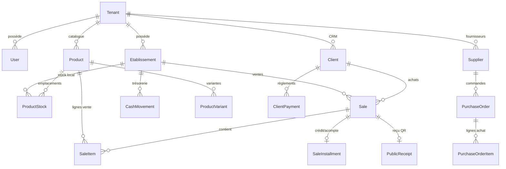

<!--
/**
 * @author @hopsyder
 * @organization Nexus Partners
 * @description Document de synthèse globale du projet Wilinwi (Description, Détails techniques, Étape actuelle, Cartographie des fonctions et Schéma de base de données)
 * @created 2026-08-01
 * @updated 2026-08-01
 * 🌐 ceo.nexuspartners.xyz
 * 📧 daoudaabassichristian@gmail.com
 */
-->

# ◈ Wilinwi — Document de Synthèse Globale du Projet

> **"Le système d'exploitation du commerce africain." — *Gérez. Vendez. Grandissez.***
> 
> **Auteur** : @hopsyder | **Organisation** : Nexus Partners  
> **Date de génération** : 01 Août 2026  
> **Statut** : Document de référence complet du projet

---

## 📋 Sommaire

1. [Description du Projet](#1-description-du-projet)
2. [Détails Techniques & Architecture](#2-détails-techniques--architecture)
3. [Étape Actuelle & Bilan d'Avancement](#3-étape-actuelle--bilan-davancement)
4. [Quel Fonction fait quoi — Cartographie Fonctionnelle](#4-quel-fonction-fait-quoi---cartographie-fonctionnelle)
5. [Schéma Complet de la Base de Données (Prisma / PostgreSQL)](#5-schéma-complet-de-la-base-de-données-prisma--postgresql)

---

## 1. Description du Projet

### 1.1 Vision & Positionnement
**Wilinwi** est une plateforme **SaaS multi-tenant** d'Afrique de l'Ouest (zone UEMOA / FCFA) conçue pour être le système d'exploitation global des PME commerçantes (boutiques, supermarchés, pharmacies, restaurants, quincailleries, grossistes).

Le système s'articule autour de 2 surfaces d'utilisation indépendantes :
1. **SaaS Client (`apps/web`)** : Application métier utilisée par les propriétaires, gérants, vendeurs, caissiers et livreurs pour la caisse (POS), le stock, les achats, la trésorerie et la gestion client.
2. **Console Super-Admin Platform (`apps/admin-web`)** : Console d'exploitation réservée à Nexus Partners pour superviser l'ensemble des entreprises (tenants), gérer les abonnements, les plans, les modules à la carte, la facturation et les métriques globales.

### 1.2 Problématiques Métier & Réponses Apportées
* **Connectivité instable / Coupures Internet**  
  * *Solution Wilinwi* : Approche **Offline-First**. Le POS fonctionne hors-ligne via une base locale IndexedDB (Dexie.js). Les ventes et mouvements sont enregistrés localement puis synchronisés automatiquement de façon **idempotente** (`clientGeneratedId`) au retour du réseau.
* **Absence de centimes (Devise FCFA / XOF)**  
  * *Solution Wilinwi* : Tous les montants financiers sont strictement stockés sous forme d'**entiers (`Int`)**. Pas de décimaux, pas de centimes, pas d'erreurs d'arrondi (`1000` = 1 000 FCFA).
* **Faible bancarisation & Poids du Mobile Money / Vente à Crédit**  
  * *Solution Wilinwi* : Prise en charge native des paiements Espèces, Mobile Money (MTN MoMo, Moov Money, Orange, Wave), Virements, Acomptes et Vente à crédit (ardoises) avec remboursement ciblé / lettrage FIFO automatique.
* **Gestion du Stock Multi-Boutiques & Entrepôt**  
  * *Solution Wilinwi* : Architecture **Hub & Spoke** (Magasin Central + Boutiques). Les réceptions fournisseurs se font au Magasin central, puis sont transférées vers les boutiques via un système de **Dispatch** formalisé.
* **Sécurité & Anti-Fraude Prix**  
  * *Solution Wilinwi* : Système à 4 prix (`prixAchat ≤ prixPlancher ≤ prixCatalogue` + `prixReel` négocié). La vente sous le prix plancher est **strictement bloquée** par l'API et le frontend. Le prix d'achat et la marge bénéficiaire sont masqués pour les rôles vendeurs/caissiers.

---

## 2. Détails Techniques & Architecture

### 2.1 Stack Technologique
* **Monorepo** : Orchestré par **Turborepo** avec gestionnaire de paquets **pnpm v10** (workspaces).
* **Frontend SaaS Client (`apps/web`)** : Next.js 15 (App Router), React 19, TailwindCSS 3.
* **Frontend Super-Admin (`apps/admin-web`)** : Next.js 15 (App Router), React 19, TailwindCSS 3 (Domaine dédié, sécurisé par allowlist IP/emails).
* **Backend API (`apps/api`)** : NestJS 11 (Architecture monolithe modulaire en TypeScript).
* **Base de Données** : Supabase PostgreSQL avec **Prisma ORM** et **Row-Level Security (RLS)** active sur 100% des tables multi-tenant.
* **Client Offline (`packages/offline`)** : IndexedDB piloté par **Dexie.js** et moteur de synchronisation autonome `SyncEngine`.
* **Partagé (`packages/types`, `packages/db`, `packages/ui`)** : Validation Zod, schéma Prisma, RLS scripts, Design System.

### 2.2 Sécurité DB & Isolation Multi-Tenant (RLS)
Le système garantit une isolation stricte des données grâce à une **double couche de rôles PostgreSQL** :
1. **Rôle Applicatif (`wilinwi_app`)** : Utilisé par l'API SaaS client (`DATABASE_URL` en mode session 5432). Soumis au **FORCE ROW LEVEL SECURITY**. Chaque requête métier s'exécute dans une transaction positionnant la variable d'environnement SQL `app.current_tenant_id`.
2. **Rôle Administrateur (`wilinwi_admin`)** : Utilisé exclusivement par la console super-admin (`ADMIN_DATABASE_URL`). Il est le seul habilité à exécuter les fonctions SQL cross-tenant du schéma fermé `app.*` (`SECURITY DEFINER`), totalement inaccessibles au rôle `wilinwi_app`.
3. **Rôle Migrations (`postgres`)** : Utilisé via `DIRECT_URL` uniquement pour appliquer les migrations Prisma et les politiques RLS.

---

## 3. Étape Actuelle & Bilan d'Avancement

### 3.1 Ce qui est entièrement livré et fonctionnel
* ✅ **Architecture Monorepo & CI/CD** : Configuration Turborepo, pnpm workspaces, GitHub Actions (`build`, `typecheck`, `test`).
* ✅ **Isolation RLS & Multi-Tenant** : 100% opérationnel avec `PrismaService.forTenant()`.
* ✅ **Module Caisse & POS (Offline-First)** : Panier, recherche rapide (Cmd+K), encaissement multi-modes (Cash, MoMo, Banque, Crédit), génération de reçu public QR (`/r/<code>`), file de synchronisation Dexie.js.
* ✅ **Architecture de Stock Hub & Spoke** : Stock par emplacement (`ProductStock`), réceptions fournisseurs (`PurchaseOrder`), transferts d'entrepôt vers boutiques (`DispatchOrder`).
* ✅ **Module CRM & Gestion des Dettes** : Fiche client, plafond de crédit, remboursement lettré avec algorithme FIFO automatique.
* ✅ **Module Trésorerie & Multi-Comptes** : Mouvements de caisse, dépenses catégorisées, transferts entre comptes avec vérification de solde, clôture de caisse avec calcul des écarts.
* ✅ **Gestion des Établissements & Appareils** : Support multi-boutiques, contrôle du nombre maximum d'appareils autorisés par plan (`Device` / `maxDevices`).
* ✅ **Console Super-Admin Platform (`apps/admin-web`)** : Gestion des entreprises, attribution des plans, modules à la carte (`moduleAddons`), facturation manuelle/échéances, métriques globales.
* ✅ **Centre de Notifications & Alertes Audit** : Notifications in-app pour rupture de stock / impayés, système d'alertes d'audit (`AuditAlert`).

### 3.2 Ce qui est prêt en Schéma / En Cours / À venir (Feuille de route)
* 🟡 **Paiement Automatique SaaS (FedaPay)** : Intégration FedaPay pour les abonnements MoMo/Wave automatisés (prévu MVP2).
* 🟡 **Péremption & Lots Pharmaceutiques (`BATCHED` / Health)** : Schéma Prisma prêt (`ProductBatch`), moteur FEFO à finaliser en Milestone 4.
* 🟡 **Recettes Restauration (`MANUFACTURED` / Food)** : Schéma prêt (`ProductRecipe`, `RecipeItem`, `FoodTable`), décrémentation des ingrédients au POS en Milestone 3.
* 🔴 **Impression Bluetooth Directe (ESC/POS)** : Impression ticket physique directe sur imprimante thermique (actuellement via page web / impression navigateur).
* 🔴 **Application Mobile Flutter** : Prévue pour le MVP3 (déjà anticipée par les APIs REST NestJS).

---

## 4. Quel Fonction fait quoi — Cartographie Fonctionnelle

### 4.1 Modules Backend NestJS (`apps/api`)

| Module Backend | Service / Fichier Principal | Quel rôle / Quelle fonction fait quoi ? |
| :--- | :--- | :--- |
| **`auth`** | `auth.service.ts`, `users.service.ts` | **Inscription / Connexion / Utilisateurs** : Inscription du propriétaire (crée le Tenant + User OWNER), login par email/mot de passe (Supabase JWT), login par code PIN sur poste partagé avec hash bcrypt, gestion des employés et révocations immédiates. |
| **`etablissement`**| `etablissement.service.ts` | **Multi-Boutiques** : Création, modification et liste des établissements d'une entreprise (Boutique, Entrepôt, Restaurant, etc.), affectation des employés (`UserEtablissement`). |
| **`stock`** | `stock.service.ts`, `product.mapper.ts` | **Catalogue & Prix** : CRUD des produits/variantes, contrôle de l'invariant des 4 prix (`achat ≤ plancher ≤ catalogue`), masquage automatique du prix d'achat/marge via `toProductDto()`. |
| **`inventory`** | `inventory.service.ts` | **Inventaire Physique** : Création d'un comptage de stock par établissement, saisie des quantités réelles, calcul des écarts et validation avec génération des mouvements d'ajustement. |
| **`pos`** | `sales.service.ts`, `sale.mapper.ts` | **Caisse & Ventes** : Traitement des ventes en caisse, contrôle strict anti-vente sous le plancher, décrémentation du stock, enregistrement du crédit client, annulations et retours de ventes. |
| **`crm`** | `clients.service.ts`, `client.mapper.ts` | **Clients & Dettes** : Gestion des clients, contrôle du plafond de crédit, encaissement de remboursements et remboursement automatique en cascade FIFO sur les factures impayées. |
| **`treasury`** | `treasury.service.ts` | **Trésorerie & Caisse** : Suivi des soldes par compte (Caisse, MoMo, Banque), saisie des dépenses, virements internes entre comptes avec contrôle du solde disponible, clôtures de caisse. |
| **`warehouse`** | `suppliers.service.ts`, `purchase-orders.service.ts`, `dispatch.service.ts` | **Approvisionnement & Logistique** : Gestion des fournisseurs (et leur dette), bons de commande et réceptions d'achats en entrepôt, création et validation des ordres de **Dispatch** (transfert entrepôt → boutique). |
| **`analytics`** | `analytics.service.ts` | **Rapports & Dashboard** : Calcul du chiffre d'affaires du jour, nombre de ventes, panier moyen, top produits, valeur du stock et bénéfice brut (masqué aux rôles non autorisés). |
| **`sync`** | `sync.module.ts` | **Synchronisation Offline** : Réception en lot des ventes créées hors-ligne par le POS client et enregistrement de manière idempotent via `clientGeneratedId`. |
| **`notifications`**| `notifications.service.ts` | **Alertes In-App** : Génération et consultation des notifications d'entreprise (stock bas, abonnement impayé, etc.). |
| **`plans`** | `plans.controller.ts` | **Abonnements & Limites** : Consultation du plan courant, des limites d'utilisation (nombre max d'utilisateurs, d'établissements, d'appareils) et des modules activés. |
| **`admin`** | `admin.controller.ts` | **Paramètres & Logs** : Consultation du journal d'activité d'un tenant (`ActivityLog`), gestion des appareils autorisés (`Device`). |
| **`platform`** | `platform.service.ts` | **Super-Admin Nexus** : Exécute via le rôle SQL `wilinwi_admin` les requêtes cross-tenant (liste globale des entreprises, KPIs SaaS, changement de plan, activation d'add-ons, relance d'impayés). |
| **`public`** | `public.controller.ts` | **Reçu Public QR** : Endpoint public sans authentification permettant de consulter un ticket de caisse dénormalisé anonyme à partir de son code QR (`/r/<code>`). |

### 4.2 Interfaces Frontend SaaS Client (`apps/web`)

| Route Frontend | Fichier Page | Description de l'interface et des fonctions |
| :--- | :--- | :--- |
| `/` | `app/(app)/page.tsx` | **Hub Central** : Tableau de bord principal orienté action avec accès rapide aux modules, vue d'ensemble et sélection de l'établissement courant. |
| `/pos` | `app/(app)/pos/page.tsx` | **Interface Caisse POS** : Interface tactile/clavier ultra-rapide avec recherche Cmd+K, gestion du panier, calcul de monnaie, encaissement multi-modes et mode offline. |
| `/pos/returns` | `app/(app)/pos/returns/page.tsx` | **Retours & Remboursements** : Interface de traitement des retours d'articles avec ré-entrée en stock et émission d'avoir/remboursement. |
| `/stock` | `app/(app)/stock/page.tsx` | **Gestion du Catalogue** : Liste des produits, ajouts/modifications, prix, seuils d'alerte, catégories et filtrage par statut de stock. |
| `/ventes` | `app/(app)/ventes/page.tsx` | **Historique des Ventes** : Inscription de toutes les ventes réalisées, filtrage par date/vendeur/mode de paiement, réimpression de reçu et annulation. |
| `/clients` | `app/(app)/clients/page.tsx` | **Gestion CRM Client** : Vue double-colonne des clients, suivi des crédits/ardoises, enregistrement de règlements de dette avec récapitulatif. |
| `/tresorerie` | `app/(app)/tresorerie/page.tsx` | **Gestion Trésorerie** : Vue des comptes (Caisse, MoMo, Banque), saisie des dépenses par catégorie, virements inter-comptes et clôtures de caisse. |
| `/entrepot` | `app/(app)/entrepot/page.tsx` | **Entrepôt Central** : Pilotage des réceptions fournisseurs, gestion des bons de commande d'achat et suivi du stock central. |
| `/entrepot/dispatch` | `app/(app)/entrepot/dispatch/page.tsx` | **Transferts (Dispatch)** : Interface de création et de validation des ordres de transfert de stock du magasin central vers les boutiques. |
| `/dashboard` | `app/(app)/dashboard/page.tsx` | **Analytics du Jour** : Visualisation graphique des ventes du jour, répartition par mode de paiement et top des articles vendus. |
| `/parametres` | `app/(app)/parametres/page.tsx` | **Configuration du Tenant** : Paramètres de l'entreprise, des établissements, des utilisateurs/rôles et des appareils autorisés. |
| `/r/[code]` | `app/r/[code]/page.tsx` | **Ticket Web Public** : Page de reçu électronique accessible par scanner le QR code imprimé sur le reçu physique. |

### 4.3 Matrice des Rôles & Capacités Utilisateur

| Fonctionnalité / Action | OWNER (Propriétaire) | MANAGER (Gérant) | SELLER (Vendeur) | CASHIER (Caissier) | DELIVERY (Livreur) |
| :--- | :---: | :---: | :---: | :---: | :---: |
| Accéder au POS & Vendre | ✅ | ✅ | ✅ | ✅ | ❌ |
| Saisir une vente à crédit / acompte | ✅ | ✅ | ❌ | ✅ | ❌ |
| Voir le prix d'achat & les marges | ✅ | ✅ | ❌ (masqué) | ❌ (masqué) | ❌ (masqué) |
| Voir le prix plancher | ✅ | ✅ | ✅ | ✅ | ❌ |
| Encadrer / lettrer les crédits clients | ✅ | ✅ | ❌ | ✅ | ❌ |
| Saisir des dépenses de trésorerie | ✅ | ✅ | ❌ | ❌ | ❌ |
| Effectuer des clôtures de caisse | ✅ | ✅ | ❌ | ✅ | ❌ |
| Valider les comptages d'inventaire | ✅ | ✅ | ❌ | ❌ | ❌ |
| Valider les réceptions & Dispatchs | ✅ | ✅ | ❌ | ❌ | ❌ |
| Gérer les utilisateurs & les PINs | ✅ | ❌ | ❌ | ❌ | ❌ |
| Modifier l'abonnement & les paramètres | ✅ | ❌ | ❌ | ❌ | ❌ |

---

## 5. Schéma Complet de la Base de Données (Prisma / PostgreSQL)

La base de données comporte **24 modèles** organisés par domaine fonctionnel. Toutes les tables métiers possèdent un champ `tenant_id` lié à la table `Tenant` sous contrôle de la **RLS PostgreSQL**.

### 5.1 Énumérations (Enums)
* **`Role`** : `OWNER`, `MANAGER`, `SELLER`, `CASHIER`, `DELIVERY`
* **`Plan`** : `STARTER`, `PRO`, `BUSINESS`, `ENTERPRISE`
* **`BillingCycle`** : `MONTHLY`, `YEARLY`
* **`SubscriptionStatus`** : `ACTIVE`, `TRIALING`, `PAST_DUE`, `CANCELLED`
* **`EtablissementType`** : `BOUTIQUE`, `SUPERMARCHE`, `PHARMACIE`, `RESTAURANT`, `ENTREPOT`, `AGENCE`, `BUREAU`, `USINE`
* **`EtablissementInfrastructure`** : `RETAIL`, `FOOD`, `HEALTH`, `SERVICE`, `WHOLESALE`
* **`ProductType`** : `STANDARD`, `BATCHED`, `MANUFACTURED`, `SERVICE`
* **`StockPolicy`** : `STRICT`, `ALLOW_NEGATIVE`, `NO_STOCK`, `RECIPE_BASED`
* **`UnitKind`** : `UNIT`, `WEIGHT`, `VOLUME`, `PACKAGE`, `TIME`
* **`StockMovementType`** : `IN`, `OUT`, `ADJUST`
* **`InventoryStatus`** : `OPEN`, `VALIDATED`, `CANCELLED`
* **`PaymentMethod`** : `CASH`, `MOBILE_MONEY`, `BANK_TRANSFER`, `CREDIT`, `INSTALLMENT`
* **`SaleStatus`** : `COMPLETED`, `PENDING_PAYMENT`, `CANCELLED`
* **`InstallmentStatus`** : `PENDING`, `PARTIAL`, `SETTLED`, `OVERDUE`
* **`CashAccount`** : `CAISSE`, `MOBILE_MONEY`, `BANQUE`
* **`CashFlowType`** : `IN`, `OUT`
* **`CashMovementSource`** : `SALE`, `EXPENSE`, `REPAYMENT`, `TRANSFER`, `ADJUSTMENT`, `OPENING`
* **`PurchaseOrderStatus`** : `DRAFT`, `ORDERED`, `PARTIAL`, `RECEIVED`, `CANCELLED`
* **`DispatchStatus`** : `DRAFT`, `VALIDATED`, `CANCELLED`
* **`NotificationType`** : `STOCK_LOW`, `PAST_DUE`, `SUPPLIER_DEBT`, `INFO`
* **`AuditAlertSeverity`** : `INFO`, `WARNING`, `CRITICAL`

---

### 5.2 Modèles par Domaine

#### A. Identité & Administration (ADN SaaS)
1. **`Tenant`** (`tenants`)
   * Identifiant unique (`id` UUID), nom de l'entreprise, pays, ville.
   * Plan SaaS (`plan`), statut d'abonnement (`subscriptionStatus`), date d'échéance (`subscriptionDueDate`), cycle de facturation (`billingCycle`).
   * Modules premium souscrits à la carte (`moduleAddons String[]`).
   * Flag `internal` (pour isoler les comptes démo des analytics plateforme).
2. **`PlanConfig`** (`plan_configs`) — *Table Globale de Référence*
   * Tarif mensuel (`priceMonthly`), annuel (`priceYearly`).
   * Limites : `maxUsers`, `maxEtablissements`, `maxDevices`, `maxPhotos` (`-1` = illimité).
3. **`InfraPricing`** (`infra_pricing`) — *Table Globale de Référence*
   * Prix mensuel additionnel par infrastructure métier (`RETAIL`, `FOOD`, `HEALTH`, etc.).
4. **`User`** (`users`)
   * Clé primaire liée à `auth.users` Supabase UUID.
   * Lien avec `tenantId`, nom, email, rôle (`Role`), code PIN crypté (`pinCode`), statut actif (`actif`).
   * Permissions personnalisées (`customPermissions`, `permissions String[]`).
5. **`Etablissement`** (`etablissements`)
   * Nom du point de vente/entrepôt, type physique (`EtablissementType`), infrastructure métier (`EtablissementInfrastructure`), ville, adresse.
6. **`UserEtablissement`** (`user_etablissements`)
   * Table d'association N-N entre `User` et `Etablissement`.
7. **`Device`** (`devices`)
   * Registre des navigateurs/appareils autorisés par entreprise (`deviceId`, `label`, `lastSeenAt`, `revokedAt`).

#### B. Catalogue Produits & Gestion du Stock
8. **`Product`** (`products`)
   * Identifiant, `tenantId`, nom, SKU, catégorie, type de produit (`ProductType`), politique de stock (`StockPolicy`).
   * **Le Système à 4 Prix** : `prixAchat` (coût), `prixPlancher` (seuil négociable minimum), `prixCatalogue` (prix public).
   * Stock global (`stock`), seuil d'alerte (`seuilAlerte`), flag `vendablePos`.
9. **`ProductVariant`** (`product_variants`)
   * Variantes de produit (taille, couleur en JSON `attributs`), SKU spécifique et stock variante.
10. **`ProductStock`** (`product_stock`)
    * Solde de stock matérialisé par emplacement (`productId` x `etablissementId`, quantité et quantité minimale d'alerte).
11. **`StockMovement`** (`stock_movements`)
    * Grand livre traçant tous les mouvements de stock (`quantite` signée, `type`: IN/OUT/ADJUST, `motif`, référence `saleId` ou `batchId`).
12. **`Inventory`** & **`InventoryItem`** (`inventories`, `inventory_items`)
    * Session d'inventaire physique par établissement, enregistrant la quantité théorique, la quantité réelle comptée et l'écart.
13. **`ProductExclusion`** (`product_exclusions`)
    * Retrait explicite d'un produit du catalogue d'un établissement spécifique.

#### C. Spécificités Métiers (Health, Food, Wholesale)
14. **`ProductBatch`** (`product_batches`) — *Pharmacie / Health*
    * Numéro de lot (`batchNumber`), date de péremption (`expiresAt`) et quantité disponible pour le suivi FEFO.
15. **`ProductRecipe`** & **`RecipeItem`** (`product_recipes`, `recipe_items`) — *Restauration / Food*
    * Fiche technique / Recette décomposant un plat fabriqué en ingrédients avec leurs quantités consommées.
16. **`FoodTable`** (`food_tables`) — *Restauration / Food*
    * Tables de restaurant rattachées aux ventes POS.
17. **`ProductUnit`** (`product_units`) — *Vente en Gros / Wholesale*
    * Conditionnements commerciaux (ex: Cartons, Caisse de 24) avec facteur de conversion vers l'unité de base (`factorToBase`).

#### D. Ventes & Caisse POS
18. **`Sale`** (`sales`)
    * Vente enregistrée, liée au `tenantId`, `etablissementId`, `vendeurId` et `clientId`.
    * Statut (`SaleStatus`), méthode de paiement (`PaymentMethod`), total en FCFA (`total`), montant versé (`montantVerse`), montant espèces (`montantEspeces`).
    * Clef d'idempotence offline (`clientGeneratedId`), code opaque du reçu QR (`receiptCode`).
    * Champs de livraison : `aLivrer`, `livreurId`, `adresseLivraison`, `livreLe`.
19. **`SaleItem`** (`sale_items`)
    * Ligne de vente : produit, variante, quantité vendue, quantité retournée, `prixReel` (4ᵉ prix négocié), `coutUnitaire` (figé pour calcul de la marge).
20. **`SaleInstallment`** (`sale_installments`)
    * Échéancier pour les ventes à crédit ou acomptes (`montantTotal`, `montantVerse`, `soldeRestant`, statut `InstallmentStatus`, date d'échéance).
21. **`PublicReceipt`** (`public_receipts`) — *Lecture Publique Sans RLS*
    * Snapshot dénormalisé anonyme des données du reçu pour consultation via le QR code (`code`, `boutiqueNom`, `total`, liste des items JSON).

#### E. CRM Client & Trésorerie
22. **`Client`** & **`ClientPayment`** (`clients`, `client_payments`)
    * Fiche client, solde créditeur/dette courante (`soldeCredit`), plafond autorisé (`plafondCredit`).
    * Historique des paiements de dettes (`ClientPayment`) avec mode de règlement.
23. **`CashMovement`** & **`CashClose`** (`cash_movements`, `cash_closes`)
    * Mouvements de trésorerie (Entrées/Sorties, compte: `CAISSE`/`MOBILE_MONEY`/`BANQUE`, source: `SALE`/`EXPENSE`/`REPAYMENT`/`TRANSFER`, catégorie).
    * Sessions de clôture de caisse enregistrant le solde théorique calculé, le solde réel compté en caisse et l'écart avec motif.

#### F. Achats, Logistique & Administration
24. **`Supplier`**, **`PurchaseOrder`**, **`PurchaseOrderItem`**, **`SupplierPayment`** (`suppliers`, `purchase_orders`, `purchase_order_items`, `supplier_payments`)
    * Fiches fournisseurs et leur solde débiteur (`soldeDette`).
    * Bons de commande d'achat (`PurchaseOrder`) avec statut (`DRAFT`, `ORDERED`, `PARTIAL`, `RECEIVED`), quantités commandées/reçues, et paiements fournisseurs.
25. **`DispatchOrder`** & **`DispatchOrderItem`** (`dispatch_orders`, `dispatch_order_items`)
    * Ordres de transfert entre un établissement source (Entrepôt central) et une destination (Boutique) avec statut (`DRAFT`, `VALIDATED`, `CANCELLED`).
26. **`Notification`**, **`AuditAlert`**, **`ActivityLog`** (`notifications`, `audit_alerts`, `activity_logs`)
    * Centre de notifications in-app pour l'entreprise.
    * Journal d'audit des anomalies détectées a posteriori (`AuditAlert`).
    * Journal d'activité traçant l'ensemble des actions des utilisateurs (`ActivityLog`: action, entité, IP, device).

---

> **Note d'information** : Ce document constitue la référence officielle du projet **Wilinwi**. Toute évolution d'architecture, de schéma de base de données ou de contrat d'API doit être répercutée dans ce fichier.
