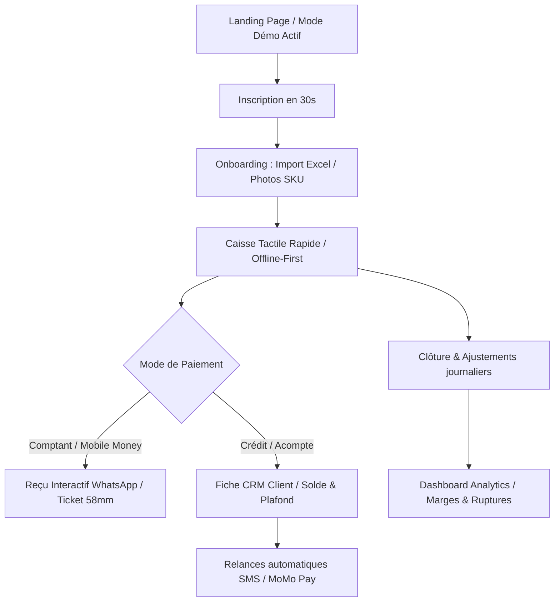

/**

* @author @hopsyder
* @organization Nexus Partners
* @description Rapport d'audit produit, UX et architecture du projet Wilinwi MVP1
* @created 2026-06-21
* @updated 2026-06-21
* 🌐 ceo.nexuspartners.xyz
* 📧 <daoudaabassichristian@gmail.com>
 */
-- ──────────────────────────────────

# Rapport d'Audit Wilinwi : Produit, UX & Architecture (MVP1)

> **Projet** : Wilinwi — Le Système d'Exploitation du Commerce Africain  
> **Auteur** : DEXTY (Nexus Partners)  
> **Date d'évaluation** : 21 Juin 2026  
> **Version cible** : MVP1 « Le Socle » (POS, Stock, Pay, CRM, Analytics, Sync, Admin)
> 
> **Mise à jour post-audit (28 Juin 2026)** : L'architecture logistique a été repensée. Le stock n'est plus global au produit, mais tracé par localisation géographique. Les bons de commande fournisseurs sont réceptionnés dans un **Magasin central**, puis transférés aux boutiques via un système de **Dispatch**.

---

## 🧠 Hypothèses Business & Limites de l'Audit

Avant d'entamer l'analyse technique et fonctionnelle, nous formulons les hypothèses suivantes basées sur les orientations de Nexus Partners :

1. **Zone géographique et monnaie** : Le marché cible principal est l'Afrique de l'Ouest (zone UEMOA). Les transactions et rapports financiers sont exprimés en **FCFA** sous forme d'entiers (pas de centimes).
2. **Utilisateurs cibles** : Boutiques de détail physiques, supérettes, quincailleries ou commerces de vêtements de taille moyenne, employant des vendeurs/caissiers potentiellement peu technophiles.
3. **Infrastructure matérielle** : L'accès à l'application se fait principalement via des tablettes, des smartphones ou des PC portables branchés en point de vente, partageant parfois le même écran à la caisse du magasin.
4. **Connectivité réseau** : La connectivité internet est intermittente. La résilience hors-ligne est une exigence absolue de survie pour l'application en magasin.
5. **Modèle de monétisation** : Modèle SaaS B2B par abonnement (`FREE`, `PRO`, `BUSINESS`) avec gating fonctionnel (limitation de modules).

---

## Phase 1 — Exploration Complète de l'Architecture

L'analyse statique du monorepo Wilinwi révèle une structure hautement modulaire, cohérente et bien découpée.

### 1. Structure du Dépôt

Le projet est structuré comme un monorepo managé par **Turborepo** et **pnpm workspaces** :

* `apps/api/` : Backend NestJS 11 structuré sous forme de monolithe modulaire. Les modules identifiés sont `auth`, `stock`, `inventory`, `pos`, `crm`, `treasury`, `analytics`, `sync` et `admin`.
* `apps/web/` : Frontend Next.js 15 (App Router) et React 19 utilisant TailwindCSS 3.
* `packages/db/` : Couche d'accès aux données avec Prisma ORM et la configuration de la sécurité au niveau de la base de données (RLS).
* `packages/types/` : Source de vérité partagée (Zod, enums, définitions TypeScript) garantissant la cohérence des contrats de données entre le frontend et le backend.
* `packages/ui/` : Design System interne basé sur des composants Tailwind standardisés.
* `packages/offline/` : Moteur de persistance IndexedDB (`Dexie.js`) et de synchronisation asynchrone (`SyncEngine`).

### 2. Multi-tenant et Isolation des Données (RLS)

Le multi-tenant est l'un des piliers les plus solides de la base de données :

* Toutes les tables métiers (à l'exception de `tenants`) possèdent une colonne `tenant_id` non nulle.
* L'isolation est assurée en base par la Row-Level Security (RLS) de PostgreSQL (`packages/db/prisma/rls.sql`).
* Le backend applique l'isolation en ouvrant systématiquement une transaction interactive via `PrismaService.forTenant(tenantId, tx => ...)` qui exécute localement `SET LOCAL app.current_tenant_id = <tenant_id>`. La RLS filtre automatiquement toutes les lectures/écritures à ce périmètre.
* **Risque de configuration identifié** : Le rôle de connexion Prisma par défaut (`postgres` sur Supabase) contourne la RLS par nature (`BYPASSRLS`). Le projet intègre un rôle applicatif restreint `wilinwi_app` sans ce privilège, qui doit impérativement être configuré en production via `DATABASE_URL` (port 5432 du pooler en mode session).

### 3. Gestion des Rôles et Permissions (RBAC)

Le modèle d'autorisation (`packages/types/src/roles.ts`) définit 5 rôles avec des privilèges atomiques clairs :

1. `OWNER` : Accès complet.
2. `MANAGER` : Accès complet sauf configuration de l'organisation et gestion des abonnements.
3. `SELLER` : Accès limité à la lecture du stock, à la création de ventes et à la lecture simple du CRM client.
4. `CASHIER` : Accès à l'encaissement, aux clôtures de caisse, au CRM client et à l'encaissement des dettes.
5. `DELIVERY` : Droits restreints aux mises à jour de livraisons.

Les routes API sont protégées par `@RequireCapabilities(...)` et le `CapabilitiesGuard`.

### 4. Sécurité au Niveau des Champs (Field-Level Security)

Pour éviter les fuites de marges ou de données sensibles auprès des employés temporaires (vendeurs, livreurs), le backend et le frontend appliquent des restrictions strictes :

* Le prix d'achat (`prixAchat`), le prix plancher (`prixPlancher`) et la marge ne sont jamais exposés aux rôles `SELLER`, `CASHIER` ou `DELIVERY`. Le mapper `toProductDto()` fait office de douane à la sortie de l'API.
* De même, le dashboard analytique masque la marge globale journalière et la valeur d'achat du stock pour ces profils.

### 5. Logique Métier de Tarification : Prix Plancher Stricte & Système de Remise

Le projet met en place une barrière de protection contre la vente à perte. Le système de tarification s'articule autour de la règle stricte suivante :
$$\text{Prix Achat} \le \text{Prix Plancher} \le \text{Prix Catalogue (Vente conseillée)} \to \text{Prix Réel (Négocié)}$$

Dans le code backend (`apps/api/src/pos/sales.service.ts`), toute négociation d'une ligne de vente en dessous du `prixPlancher` lève immédiatement une exception bloquante :

```typescript
const sousPlancher = item.prixReel < product.prixPlancher;
if (sousPlancher) {
  throw new BadRequestException(`Opération refusée : le prix de vente de "${product.nom}" est inférieur au prix plancher fixe...`);
}
```

Cette protection empêche toute facturation en dessous du prix plancher, garantissant que chaque vente génère du bénéfice, y compris pour les clients fidèles à gros volumes. 

**Évolution Métier requise pour la Négociation** :
Afin d'offrir une flexibilité commerciale sans compromettre la marge :
*   Le **prix plancher reste une limite absolue** infranchissable par le vendeur.
*   Le gérant ou le caissier peut appliquer une **réduction en pourcentage (de 1% à 30%)** par rapport au prix catalogue (sans jamais passer sous le prix plancher).
*   L'attribution de cette réduction doit être soumise à une **validation obligatoire par le Propriétaire (`OWNER`)** : la vente est mise en attente de validation, et le propriétaire reçoit une notification en temps réel pour approuver ou rejeter le pourcentage de remise accordé.

---

## Phase 2 — Inventaire des Fonctionnalités Existantes

| Module | Fonctionnalité | Statut | Emplacement dans le Code |
| :--- | :--- | :--- | :--- |
| **Auth** | Inscription propriétaire & boutique | **Complet** | `apps/api/src/auth/auth.service.ts#L51`, `apps/web/src/app/signup/page.tsx` |
| **Auth** | Bascule rapide de session par PIN | **Complet** | `apps/api/src/auth/auth.service.ts#L147`, `apps/web/src/components/PinSwitchModal.tsx` |
| **Auth** | Invitation de collaborateurs | **Partiel** | `apps/api/src/auth/auth.service.ts#L88` *(Création auth + claims ok, mais pas d'envoi d'email/SMS de bienvenue)* |
| **Stock** | Gestion de produits & variantes | **Complet** | `apps/api/src/stock/`, `apps/web/src/components/stock-modals.tsx` |
| **Stock** | Mouvements (Entrée/Sortie/Ajustement) | **Complet** | `apps/api/src/stock/stock.service.ts` |
| **Stock** | Inventaire physique avec écarts | **Complet** | `apps/api/src/inventory/` |
| **Caisse** | Panier d'achat tactil & Négociation | **Complet** | `apps/web/src/app/(app)/pos/page.tsx` |
| **Caisse** | Encaissement (Modale de validation) | **Complet** | `apps/web/src/components/pos-checkout.tsx` |
| **Caisse** | Impression du ticket client | **Partiel** | `apps/web/src/app/(app)/pos/page.tsx#L552` *(Via TodaySalesPanel.printReceipt)*, `apps/web/src/components/pos-checkout.tsx#L207` *(Bouton en fin de vente simulant l'action par une alerte)* |
| **Caisse** | Synchronisation hors-ligne | **Complet** | `packages/offline/src/sync.ts`, `apps/api/src/sync/sync.module.ts` |
| **CRM** | Création de fiche client & Notes | **Complet** | `apps/api/src/crm/clients.service.ts#L38`, `apps/web/src/app/(app)/clients/page.tsx` |
| **CRM** | Plafond de crédit & Alerte | **Complet** | `apps/api/src/pos/sales.service.ts#L669` *(Vérification en base avant création de vente à crédit)* |
| **CRM** | Remboursements & FIFO Dettes | **Complet** | `apps/api/src/crm/clients.service.ts#L90` *(Lettrage automatique FIFO sur les ventes PENDING_PAYMENT)* |
| **Trésorerie** | Comptes financiers séparés | **Complet** | `apps/api/src/treasury/treasury.service.ts`, `apps/web/src/app/(app)/tresorerie/page.tsx` |
| **Trésorerie** | Dépenses & Flux manuels | **Complet** | `apps/api/src/treasury/treasury.service.ts#L111` |
| **Trésorerie** | Clôture de caisse (comptage réel) | **Complet** | `apps/api/src/treasury/treasury.service.ts#L247` *(Motif obligatoire en cas d'écart)* |
| **Trésorerie** | Virement de fonds entre comptes | **Complet** | `apps/api/src/treasury/treasury.service.ts#L153` *(Vérification de solde suffisant en amont)* |
| **Analytics** | Dashboard journalier & valorisation | **Complet** | `apps/api/src/analytics/analytics.service.ts`, `apps/web/src/app/(app)/dashboard/page.tsx` |
| **Market** | Catalogue partagé / WhatsApp | **Absent** | N/A *(Prévu MVP2/3)* |
| **AI** | Assistant intelligent de commerce | **Absent** | N/A *(Prévu MVP3)* |

---

## Phase 3 — Parcours Utilisateurs & Points de Friction Réels

### 1. Le Parcours du Propriétaire (OWNER)

* **Flux actuel** : Inscription de la boutique $\to$ Invitation des collaborateurs via l'interface Paramètres $\to$ Création du catalogue produit $\to$ Consultation du tableau de bord et des marges.
* **Friction UX majeure** : L'invitation d'un membre génère un mot de passe temporaire affiché à l'écran que le propriétaire doit transmettre manuellement (par WhatsApp ou SMS) au collaborateur. Il n'y a aucun moyen de copier un lien d'invitation formaté ou de l'envoyer directement en un clic. De plus, il n'existe pas d'importateur de stock (CSV/Excel), obligeant le propriétaire à ajouter ses centaines d'articles un par un à la main.

### 2. Le Parcours du Vendeur (SELLER)

* **Flux actuel** : Déverrouillage de la session par PIN sur l'ordinateur de caisse $\to$ Recherche de produit (clavier ou tactile) $\to$ Négociation du prix réel si nécessaire $\to$ Validation du panier $\to$ Envoi à l'encaissement.
* **Friction UX majeure** : Si un client tente de négocier en dessous du prix plancher et que le vendeur accepte (par exemple pour liquider un article légèrement abîmé), l'application rejette brutalement l'encaissement. Le vendeur est forcé d'annuler sa vente ou d'appeler physiquement le gérant pour qu'il se connecte avec son compte afin de modifier la fiche produit. Le flux de demande d'autorisation à distance (Overriding) est totalement inactif.

### 3. Le Parcours du Caissier (CASHIER)

* **Flux actuel** : Réception du panier $\to$ Choix du mode de paiement (Espèces, MoMo, Moov, Crédit, Acompte) $\to$ Rendu de monnaie calculé $\to$ Impression du reçu $\to$ Clôture de caisse en fin de journée.
* **Friction UX majeure** : Lors de la finalisation de la vente, le bouton "Imprimer le ticket" de la modale de succès affiche une boîte d'alerte javascript au lieu de lancer l'impression. Le caissier doit fermer la modale, ouvrir l'onglet "Historique", chercher la vente qui vient d'être faite et cliquer sur "Imprimer" pour enfin ouvrir la fenêtre d'impression système.

### 4. Le Parcours du Livreur (DELIVERY)

* **Flux actuel** : Théoriquement défini dans le code de sécurité.
* **Friction UX majeure** : **Absence totale d'interface utilisateur**. Un livreur qui se connecte sur `apps/web` fait face à une page vide ou à des erreurs de droits d'accès sur tous les modules existants.

---

## Phase 4 — Le Workflow UX Pro Idéal

Pour transformer Wilinwi d'un utilitaire de gestion de stock en un outil indispensable au quotidien, le workflow doit s'inspirer des meilleures pratiques du SaaS B2B mature :



### 1. Acquisition et Première Impression

* **Idéal** : Permettre au commerçant d'ouvrir une session de démo pré-remplie ("Mode Bac à Sable") en un seul clic sur le site vitrine. Il peut simuler une vente, tester la modification des prix et voir le comportement hors-ligne en coupant son réseau, sans avoir créé de compte.

### 2. Onboarding et Activation (Time to Value)

* **Idéal** : Lors de la première connexion, un importateur intelligent guide l'utilisateur pour charger son fichier Excel de produits ou le catalogue d'une autre application. Un tutoriel interactif (style *Linear*) le guide pour réaliser sa première vente test en moins de 60 secondes.

### 3. Usage Quotidien (La Boucle Principale)

* **Idéal** : Caisse utilisable en mobile-first avec l'appareil photo du smartphone comme scanner de code-barres.
* **Validation de Remise à Distance** : Le prix de vente ne peut jamais descendre en dessous du prix plancher fixe. Cependant, si le vendeur ou le gérant applique une réduction (de 1% à 30% du prix catalogue), la vente passe en statut `PENDING_APPROVAL`. Une notification instantanée est envoyée sur l'appareil du propriétaire (`OWNER`). Ce dernier peut valider ou refuser la remise d'un simple geste, débloquant immédiatement l'encaissement au POS.

### 4. Notifications et Engagement

* **Idéal** : Plus de reçus papier égarés ou coûteux. L'application envoie un reçu numérique structuré par WhatsApp avec un QR code permettant au client de consulter sa facture en ligne (via `PublicReceipt`).
* **Relance de dettes in-SaaS** : Les alertes et relances de dettes sont centralisées et affichées directement dans le centre de notifications et le tableau de bord du SaaS. Cela permet au caissier ou au gérant d'avoir une vision proactive des clients débiteurs (ex. alerte visuelle au POS si le client passe une nouvelle commande ou relance par appel direct), éliminant ainsi les coûts de communication SMS/WhatsApp sortants.

### 5. Facturation et Monétisation

* **Idéal** : Intégration de passerelles locales (FedaPay, Wave, MTN MoMo, Moov) directement pour le paiement de l'abonnement du commerçant. Possibilité de payer par rechargement de solde local sans carte bancaire internationale.

---

## Phase 5 — Écarts et Fonctionnalités à Ajouter

### 1. Fonctionnalités Indispensables (Must-Have)

| Fonctionnalité | Rationale / Pourquoi c'est critique | Complexité | Impact Business |
| :--- | :--- | :--- | :--- |
| **Validation asynchrone des prix planchers** | Débloquer la négociation légitime en magasin tout en gardant le contrôle financier par le gérant. Évite le blocage d'une vente en cours. | Moyenne | Élevé |
| **Intégration d'impression directe (ESC/POS)** | Les commerces physiques ont besoin d'imprimer des tickets de caisse physiques en Bluetooth/USB (formats 58mm/80mm) sans passer par la boîte de dialogue d'impression système lourde et inadaptée. | Moyenne | Élevé |
| **UI de consultation des logs d'activité** | Permet au propriétaire d'auditer les connexions par PIN, les modifications de stock ou les annulations de ventes pour lutter contre le vol interne. | Faible | Élevé |

### 2. Fonctionnalités Différenciantes (Should-Have)

| Fonctionnalité | Rationale / Pourquoi c'est critique | Complexité | Impact Business |
| :--- | :--- | :--- | :--- |
| **Scanner de code-barres photo** | Permet d'accélérer la saisie sur smartphone/tablette sans acheter de douchettes matérielles coûteuses. | Moyenne | Élevé |
| **Importateur/Exportateur Excel (Stock)** | Indispensable pour la phase d'onboarding de commerces ayant plus de 100 produits. Le cas contraire bloque l'activation. | Faible | Élevé |
| **Relances automatiques WhatsApp (Dettes)** | Automatise le recouvrement des dettes clients, augmentant la trésorerie disponible du commerçant. | Moyenne | Élevé |

### 3. Améliorations Techniques et Non-Fonctionnelles

| Fonctionnalité | Rationale / Pourquoi c'est critique | Complexité | Impact Business |
| :--- | :--- | :--- | :--- |
| **Validation RLS au flush de synchronisation** | Le backend doit revérifier rigoureusement que les données synchronisées hors-ligne respectent les contraintes (prix planchers réels) au moment du flush, pour éviter les injections de prix frauduleuses dans la base locale IndexedDB par un employé malveillant. | Faible | Élevé |
| **Synchronisation différentielle du stock** | Ne charger que les deltas de stock ou les produits modifiés lors de la reconnexion pour préserver les forfaits internet (données mobiles 3G/4G chères). | Élevée | Moyen |
| **Conformité fiscale (DGI Bénin/CI)** | Rendre l'application conforme aux réglementations de facturation normalisée locales pour éviter des amendes fiscales aux clients. | Élevée | Moyen |

---

## Phase 6 — Plan de Priorisation Fonctionnelle

```
[Quick Wins - < 1 semaine]
├── Raccorder l'impression de ticket à la modale de succès de caisse.
├── Partage de reçu structuré par WhatsApp (pré-remplissage du numéro client).
└── Nettoyer le code mort lié à PriceOverride ou rétablir le statut PENDING_APPROVAL.

[Version Pro - 1 à 2 mois]
├── Import/Export Excel du catalogue produit.
├── Module de scan de code-barres par caméra (HTML5 QR/Barcode Scanner).
├── Tableau de bord d'audit (Activity Logs) pour le OWNER.
└── Intégration FedaPay pour le paiement des abonnements.

[Vision Long Terme]
├── Application mobile native Flutter (POS fluide, impression Bluetooth directe).
├── Catalogue WhatsApp synchronisé (Wilinwi Market) pour la prise de commande directe.
└── Module de comptabilité automatisé et connexions aux APIs des fiscs locaux.
```

---

## Phase 7 — Relecture Critique & Angles Morts

### 1. Risques et failles de sécurité hors-ligne

En mode hors-ligne, le catalogue produit (contenant le `prixPlancher` et le `prixAchat`) est stocké en clair dans IndexedDB. Un employé ayant des compétences techniques minimales peut ouvrir les DevTools du navigateur, modifier la base locale de Dexie pour abaisser le prix plancher à 0, réaliser la vente, et le client repartira avec l'article. Lors de la reconnexion, le serveur rejettera le flush de synchronisation, mais la marchandise aura déjà quitté la boutique.

* **Recommandation** : Chiffrer ou masquer les colonnes sensibles (`prixAchat` et `prixPlancher`) dans la base locale IndexedDB en n'y stockant qu'un hash de validation ou en déportant les contrôles stricts uniquement sur le serveur (avec alerte de fraude à la reconnexion).

### 2. Coût des communications et modèle économique

L'envoi de SMS et de messages WhatsApp automatiques en Afrique de l'Ouest génère des coûts variables importants (frais de courtage SMS ou frais de templates Meta WhatsApp) qui peuvent grever l'unité économique du SaaS.

* **Recommandation** : Afficher et centraliser les relances et suivis de dettes directement dans le système de notifications interne (in-SaaS) de Wilinwi. Les caissiers et gérants sont alertés des échéances de paiement directement sur le tableau de bord et lors de la sélection du client en caisse. Cela permet un suivi 100% gratuit et extrêmement ciblé, sans frais de communication externes pour la plateforme.

---

## Résumé Exécutif

**Wilinwi** présente des fondations architecturales et de sécurité (multi-tenant RLS PostgreSQL, double-authentification Supabase/PIN, synchronisation IndexedDB) d'une **qualité exceptionnelle**, proche du niveau entreprise. Cependant, l'expérience utilisateur de caisse souffre de ruptures fonctionnelles (impression simulée, invitations manuelles) et d'incohérences de code (le blocage strict du prix plancher désactive de fait le module d'approbation et crée du code mort). Le produit se situe actuellement au niveau **MVP Avancé**, prêt pour la croissance moyennant le nettoyage du système à 4 prix et l'ajout d'outils d'importation de catalogue.

**Emplacement du rapport** : [audit-report.md](file:///home/hopsyder/Projet/Wilinwi/docs/audit-report.md)
