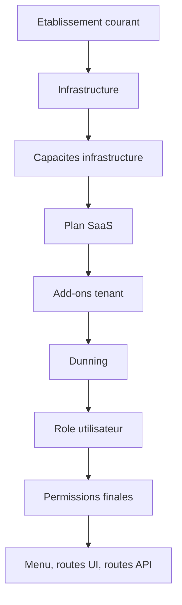
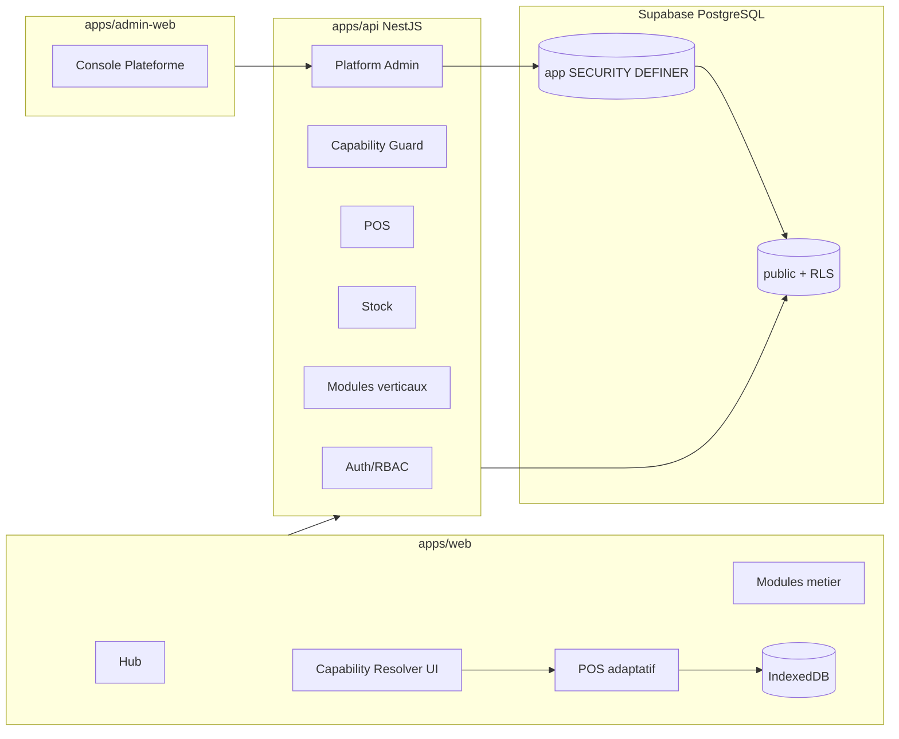
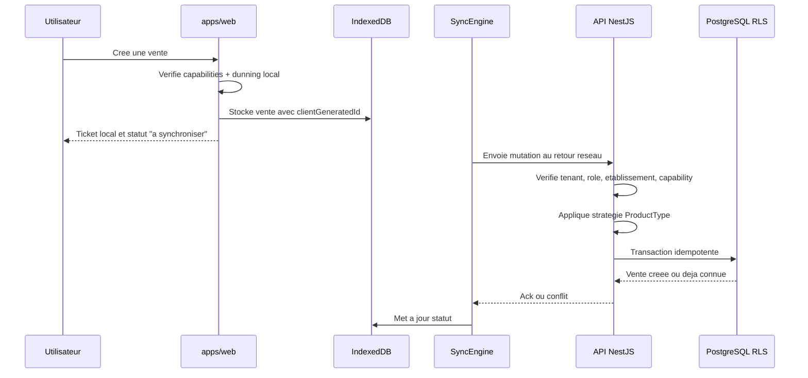

# New Plan TDR - Mise a jour strategique du SaaS Wilinwi

> **Projet** : Wilinwi  
> **Objet** : Termes de Reference et Specifications mises a jour apres segmentation client, infrastructures d'etablissement et typage produit  
> **Version** : 2.0  
> **Date** : 04 juillet 2026  
> **Statut** : Nouveau plan directeur a valider  
> **Auteur fonctionnel** : Chef de Projet Senior / Redaction Technique  
> **Profondeur** : Complete  

---

## Sommaire

1. [Synthese executive](#1-synthese-executive)
2. [Incoherences detectees et arbitrages recommandes](#2-incoherences-detectees-et-arbitrages-recommandes)
3. [Vision produit mise a jour](#3-vision-produit-mise-a-jour)
4. [Segmentation des clients cibles](#4-segmentation-des-clients-cibles)
5. [Architecture modulaire par infrastructure d'etablissement](#5-architecture-modulaire-par-infrastructure-detablissement)
6. [Architecture technique cible](#6-architecture-technique-cible)
7. [Modele de donnees Prisma cible](#7-modele-de-donnees-prisma-cible)
8. [Specifications fonctionnelles par module](#8-specifications-fonctionnelles-par-module)
9. [Regles metier critiques](#9-regles-metier-critiques)
10. [Offline-first et synchronisation](#10-offline-first-et-synchronisation)
11. [Securite, RLS et gouvernance des acces](#11-securite-rls-et-gouvernance-des-acces)
12. [Facturation SaaS, plans, add-ons et dunning](#12-facturation-saas-plans-add-ons-et-dunning)
13. [Roadmap d'execution](#13-roadmap-dexecution)
14. [Ordres de travail pour l'agent de code](#14-ordres-de-travail-pour-lagent-de-code)
15. [Criteres d'acceptation globaux](#15-criteres-dacceptation-globaux)
16. [Risques residuels et validations humaines](#16-risques-residuels-et-validations-humaines)
17. [ADR structurants](#17-adr-structurants)

---

## 1. Synthese executive

Wilinwi doit evoluer d'un SaaS de gestion commerciale generaliste vers une plateforme verticale modulaire capable de servir plusieurs metiers sans dupliquer le produit.

La mise a jour structurante est la suivante :

- le **Tenant** represente l'entreprise cliente ;
- l'**Etablissement** represente un site d'exploitation ;
- chaque etablissement porte une **infrastructure metier** : Retail, Food, Health, Service ou Wholesale ;
- chaque produit porte un **type de comportement stock/vente** : Standard, Batched, Manufactured ou Service ;
- les modules visibles et les regles de vente sont derives d'une matrice de capacites, puis filtres par le plan SaaS, les add-ons, le role utilisateur, l'etablissement courant et l'etat de facturation.
- Parametre traducteur de langues : en cas de multi-etablissements, chaque etablissement peut avoir sa propre langue de preference, pour les modules metiers activés.
- Parametre devise : en cas de multi-etablissements, chaque etablissement peut avoir sa propre devise de preference.
- Parametre zone horaire : en cas de multi-etablissements, chaque etablissement peut avoir sa propre fuseau horaire de preference.

Objectif : permettre a une meme entreprise de gerer, par exemple, une boutique retail, un depot wholesale et un restaurant dans le meme tenant, sans casser l'experience utilisateur ni le modele de securite.

Decision recommandee : adopter l'architecture par **capacites** plutot que par `if/else` disperses dans le frontend. L'infrastructure d'un etablissement active des capacites fonctionnelles, mais ne doit pas devenir une duplication du code par secteur.

---

## 2. Incoherences detectees et arbitrages recommandes

### 2.1 Incoherence : "tenant vide avec 0 module metier"

Le plan propose un tenant initialement vide, sans module metier, jusqu'a la creation d'un etablissement.

**Probleme** : l'experience d'onboarding risque d'etre confuse. Un utilisateur qui termine son inscription arrive dans un espace presque vide, ce qui peut etre percu comme un bug ou un produit incomplet.

**Recommandation** :

- garder un socle tenant toujours actif : Hub minimal, Parametres, Equipe, Facturation, Aide ;
- rendre la creation du premier etablissement obligatoire pendant l'onboarding ;
- activer l'experience metier apres choix de l'infrastructure du premier etablissement.

### 2.2 Incoherence : confusion possible entre `type` d'etablissement et `infrastructure`

Le schema actuel contient deja `EtablissementType` : BOUTIQUE, SUPERMARCHE, PHARMACIE, RESTAURANT, ENTREPOT, etc.

**Probleme** : remplacer `type` par `infrastructure` ferait perdre une information physique utile.

**Recommandation** : conserver les deux champs.

- `type` = nature physique ou administrative du site ;
- `infrastructure` = logique metier activee.

Exemples :

| Type physique | Infrastructure metier | Exemple |
| --- | --- | --- |
| `BOUTIQUE` | `RETAIL` | Boutique de vetements |
| `RESTAURANT` | `FOOD` | Maquis ou fast-food |
| `PHARMACIE` | `HEALTH` | Officine |
| `ENTREPOT` | `WHOLESALE` | Depot de boissons |
| `AGENCE` | `SERVICE` | Garage ou salon |

### 2.3 Incoherence : infrastructure, plan SaaS et add-ons ne doivent pas etre melanges

Le plan suggere que l'infrastructure injecte les modules. C'est juste, mais incomplet.

**Probleme** : une fonctionnalite peut etre :

- permise par l'infrastructure ;
- mais bloquee par le plan ;
- ou vendue comme add-on ;
- ou bloquee par dunning ;
- ou interdite par le role utilisateur.

**Recommandation** : introduire une resolution de capacites en couches.

Ordre de resolution :

1. Capacites de base de l'infrastructure d'etablissement.
2. Capacites incluses par le plan SaaS.
3. Capacites ajoutees par les add-ons premium.
4. Capacites retirees par le dunning.
5. Capacites filtrees par le role et les permissions utilisateur.

### 2.4 Incoherence : `ProductType` ne remplace pas l'infrastructure

Le document segmentation propose `ProductType`. Le document infrastructure propose `EtablissementInfrastructure`.

**Risque** : croire qu'un seul des deux suffit.

**Decision recommandee** : il faut les deux.

- `Etablissement.infrastructure` pilote l'interface et les modules disponibles ;
- `Product.type` pilote le comportement de stock et de vente du produit.

Exemple : un restaurant `FOOD` vend des boissons `STANDARD`, des plats `MANUFACTURED` et parfois des prestations `SERVICE`.

### 2.5 Incoherence : tous les modules sectoriels ne doivent pas etre construits au meme niveau de maturite

Les verticales Health, Food et Wholesale ajoutent des contraintes lourdes : lots, peremption, recettes, multi-conditionnement.

**Risque** : sur-ingenierie immediate, ralentissement du MVP et dette fonctionnelle.

**Recommandation** : livrer une fondation commune maintenant, puis activer les modules profonds par phases.

Priorite :

1. `ProductType` + `EtablissementInfrastructure` + matrice de capacites.
2. `STANDARD` et `SERVICE` complets.
3. `MANUFACTURED` minimal sans recettes complexes, puis recettes.
4. `BATCHED` avec lots/peremption.
5. Multi-conditionnement Wholesale.

### 2.6 Incoherence : vente offline et lots/peremption

La vente offline est centrale pour Wilinwi, mais les lots de pharmacie exigent une coherence forte.

**Risque** : vendre offline un lot expire ou deja epuise cote serveur.

**Recommandation** :

- autoriser offline complet pour `STANDARD` et `SERVICE` ;
- autoriser offline limite pour `MANUFACTURED` selon stock ingredient local ;
- restreindre ou renforcer fortement offline pour `BATCHED`, avec snapshot local des lots et validation serveur obligatoire au retour reseau ;
- journaliser les conflits Health comme alertes critiques.

### 2.7 Incoherence : le menu conditionnel ne doit pas etre la seule barriere

Masquer un lien dans le frontend ne protege rien.

**Recommandation** :

- le backend doit appliquer les memes capacites ;
- les routes API doivent verifier tenant, etablissement, role, dunning et capability ;
- le frontend ne fait que reflechir l'etat autorise.

---

## 3. Vision produit mise a jour

Wilinwi devient une plateforme SaaS multi-tenant et multi-infrastructures, adaptee aux realites commerciales d'Afrique de l'Ouest :

- reseau instable ;
- paiement cash et Mobile Money ;
- vente a credit ;
- prix negocies ;
- stock multi-emplacements ;
- activites hybrides ;
- faible maturite numerique de certains utilisateurs ;
- besoin de pilotage central pour plusieurs points de vente.

La vision produit cible :

> Wilinwi permet a une PME de demarrer avec une caisse simple, puis d'activer progressivement les briques metier correspondant a ses etablissements : boutique, restaurant, pharmacie, salon, garage, depot ou grossiste.

### 3.1 Principes directeurs

- **MVP minimal mais extensible** : poser les bons champs structurants maintenant, livrer les modules complexes par phases.
- **Infrastructure par etablissement** : un tenant peut avoir plusieurs metiers.
- **Capacites plutot que conditions dispersees** : une matrice decide ce qui est disponible.
- **Offline-first raisonne** : tout ce qui est vital doit fonctionner offline, mais pas au prix d'une incoherence dangereuse.
- **FCFA en entiers** : aucun montant metier en flottant.
- **RLS obligatoire** : la base reste le dernier rempart multi-tenant.

---

## 4. Segmentation des clients cibles

### 4.1 Tableau de segmentation

| Segment | Exemples | Infrastructure | Produits typiques | Contraintes critiques |
| --- | --- | --- | --- | --- |
| Retail Standard | Vetements, cosmetiques, quincaillerie | `RETAIL` | `STANDARD` | Stock unitaire, prix plancher, inventaire |
| Sante / Parapharmacie | Pharmacies, depots medicaux | `HEALTH` | `BATCHED`, `STANDARD` | Lots, peremption, FEFO, tracabilite |
| Restauration / Food | Maquis, fast-food, boulangerie | `FOOD` | `STANDARD`, `MANUFACTURED` | Tables, cuisine, recettes, vente sans stock plat |
| Services + Ventes | Coiffure, spa, garage | `SERVICE` | `SERVICE`, `STANDARD` | RDV, main-d'oeuvre, commissions, consommables |
| Grossistes / Depots | Boissons, distribution | `WHOLESALE` | `STANDARD`, conditionnements | Carton/casier/palette, credit, livraison |

### 4.2 Impacts produit

Les segments ne justifient pas cinq produits differents. Ils justifient un meme noyau SaaS avec :

- un POS adaptable ;
- un stock configurable ;
- un catalogue produit type ;
- des modules sectoriels ;
- une facturation capable de vendre des add-ons ;
- une experience par etablissement.

### 4.3 Impacts techniques

Chaque segment ajoute des contraintes :

- Retail : stock simple et performance POS.
- Health : lots, dates, interdiction de vente expiree.
- Food : vente de produits fabriques sans stock direct.
- Service : produits immateriels et planning.
- Wholesale : conversion d'unites et dette client robuste.

---

## 5. Architecture modulaire par infrastructure d'etablissement

### 5.1 Definition

Une infrastructure d'etablissement est une configuration metier qui active un ensemble de capacites, d'ecrans, de workflows et de regles API pour un etablissement donne.

```prisma
enum EtablissementInfrastructure {
  RETAIL
  FOOD
  HEALTH
  SERVICE
  WHOLESALE
}
```

### 5.2 Infrastructure par etablissement

```prisma
model Etablissement {
  id             String                      @id @default(uuid()) @db.Uuid
  tenantId       String                      @map("tenant_id") @db.Uuid
  nom            String
  type           EtablissementType           @default(BOUTIQUE)
  infrastructure EtablissementInfrastructure @default(RETAIL)
  ville          String?
  adresse        String?
  telephone      String?
  actif          Boolean                     @default(true)
  createdAt      DateTime                    @default(now()) @map("created_at")
  updatedAt      DateTime                    @updatedAt @map("updated_at")

  tenant         Tenant                      @relation(fields: [tenantId], references: [id], onDelete: Cascade)

  @@index([tenantId])
  @@index([tenantId, infrastructure])
  @@map("etablissements")
}
```

### 5.3 Matrice de capacites

L'application ne doit pas utiliser uniquement des flags `isFood`, `isHealth`, etc. Ces flags peuvent aider l'UI, mais la source de verite doit etre une matrice de capacites.

```ts
export const INFRA_CAPABILITIES = {
  RETAIL: [
    'pos.standard',
    'stock.simple',
    'inventory.basic',
    'pricing.floor',
  ],
  FOOD: [
    'pos.touch',
    'food.tables',
    'food.kitchen',
    'stock.simple',
    'recipes.basic',
  ],
  HEALTH: [
    'pos.standard',
    'stock.simple',
    'stock.batches',
    'stock.expiry',
    'stock.fefo',
  ],
  SERVICE: [
    'pos.service',
    'appointments.basic',
    'staff.commissions',
    'stock.consumables',
  ],
  WHOLESALE: [
    'pos.wholesale',
    'stock.simple',
    'stock.unitConversions',
    'crm.creditAdvanced',
    'deliveries.advanced',
  ],
} as const;
```

### 5.4 Resolution des capacites



### 5.5 Parcours onboarding recommande

1. Creation du compte et du tenant.
2. Creation obligatoire du premier etablissement.
3. Choix du type physique et de l'infrastructure.
4. Creation d'un catalogue minimal ou import.
5. Choix du mode de stock : strict, permissif ou hybride selon produit.
6. Acces au Hub metier.

---

## 6. Architecture technique cible

### 6.1 Vue d'ensemble



### 6.2 Frontend client

Responsabilites :

- detecter l'etablissement courant ;
- charger son infrastructure ;
- resoudre les capacites effectives ;
- afficher le POS adapte ;
- masquer les modules non disponibles ;
- conserver les operations offline compatibles ;
- afficher les restrictions de dunning.

### 6.3 Backend API

Responsabilites :

- resoudre les capacites cote serveur ;
- appliquer les controles avant toute mutation ;
- executer les strategies de stock selon `Product.type` ;
- maintenir l'idempotence offline ;
- appliquer RLS via contexte tenant ;
- exposer des modules verticaux sans casser le noyau.

### 6.4 Base de donnees

La base reste PostgreSQL/Supabase avec Prisma, RLS et fonctions `SECURITY DEFINER`.

Regle centrale : les nouvelles tables verticales doivent aussi porter `tenant_id` et, lorsque pertinent, `etablissement_id`.

---

## 7. Modele de donnees Prisma cible

### 7.1 Enums a ajouter

```prisma
enum EtablissementInfrastructure {
  RETAIL
  FOOD
  HEALTH
  SERVICE
  WHOLESALE
}

enum ProductType {
  STANDARD
  BATCHED
  MANUFACTURED
  SERVICE
}

enum StockPolicy {
  STRICT
  ALLOW_NEGATIVE
  NO_STOCK
  RECIPE_BASED
}

enum UnitKind {
  UNIT
  WEIGHT
  VOLUME
  PACKAGE
  TIME
}
```

### 7.2 Mise a jour `Etablissement`

```prisma
model Etablissement {
  id             String                      @id @default(uuid()) @db.Uuid
  tenantId       String                      @map("tenant_id") @db.Uuid
  nom            String
  type           EtablissementType           @default(BOUTIQUE)
  infrastructure EtablissementInfrastructure @default(RETAIL)
  ville          String?
  adresse        String?
  telephone      String?
  actif          Boolean                     @default(true)
  createdAt      DateTime                    @default(now()) @map("created_at")
  updatedAt      DateTime                    @updatedAt @map("updated_at")

  tenant         Tenant                      @relation(fields: [tenantId], references: [id], onDelete: Cascade)

  @@index([tenantId])
  @@index([tenantId, infrastructure])
  @@map("etablissements")
}
```

### 7.3 Mise a jour `Product`

```prisma
model Product {
  id            String      @id @default(uuid()) @db.Uuid
  tenantId      String      @map("tenant_id") @db.Uuid
  nom           String
  sku           String?
  categorie     String?
  type          ProductType @default(STANDARD)
  stockPolicy   StockPolicy @default(STRICT) @map("stock_policy")
  unitKind      UnitKind    @default(UNIT) @map("unit_kind")
  baseUnit      String?     @map("base_unit")
  photos        String[]    @default([])
  prixAchat     Int         @map("prix_achat")
  prixPlancher  Int         @map("prix_plancher")
  prixCatalogue Int         @map("prix_catalogue")
  stock         Int         @default(0)
  seuilAlerte   Int         @default(5) @map("seuil_alerte")
  actif         Boolean     @default(true)
  createdAt     DateTime    @default(now()) @map("created_at")
  updatedAt     DateTime    @updatedAt @map("updated_at")

  tenant        Tenant      @relation(fields: [tenantId], references: [id], onDelete: Cascade)

  @@unique([tenantId, sku])
  @@index([tenantId])
  @@index([tenantId, type])
  @@map("products")
}
```

### 7.4 Lots et peremption - Health

```prisma
model ProductBatch {
  id              String    @id @default(uuid()) @db.Uuid
  tenantId        String    @map("tenant_id") @db.Uuid
  etablissementId String    @map("etablissement_id") @db.Uuid
  productId       String    @map("product_id") @db.Uuid
  batchNumber     String    @map("batch_number")
  expiresAt       DateTime  @map("expires_at")
  quantite        Int       @default(0)
  createdAt       DateTime  @default(now()) @map("created_at")
  updatedAt       DateTime  @updatedAt @map("updated_at")

  tenant          Tenant        @relation(fields: [tenantId], references: [id], onDelete: Cascade)
  etablissement   Etablissement @relation(fields: [etablissementId], references: [id], onDelete: Cascade)
  product         Product       @relation(fields: [productId], references: [id], onDelete: Cascade)

  @@index([tenantId])
  @@index([tenantId, productId, expiresAt])
  @@unique([tenantId, etablissementId, productId, batchNumber])
  @@map("product_batches")
}
```

### 7.5 Recettes et ingredients - Food

```prisma
model ProductRecipe {
  id        String   @id @default(uuid()) @db.Uuid
  tenantId  String   @map("tenant_id") @db.Uuid
  productId String   @unique @map("product_id") @db.Uuid
  name      String?
  active    Boolean  @default(true)
  createdAt DateTime @default(now()) @map("created_at")
  updatedAt DateTime @updatedAt @map("updated_at")

  tenant    Tenant   @relation(fields: [tenantId], references: [id], onDelete: Cascade)
  product   Product  @relation(fields: [productId], references: [id], onDelete: Cascade)
  items     RecipeItem[]

  @@index([tenantId])
  @@map("product_recipes")
}

model RecipeItem {
  id                 String   @id @default(uuid()) @db.Uuid
  tenantId           String   @map("tenant_id") @db.Uuid
  recipeId           String   @map("recipe_id") @db.Uuid
  ingredientProductId String  @map("ingredient_product_id") @db.Uuid
  quantity           Int
  unit               String

  recipe             ProductRecipe @relation(fields: [recipeId], references: [id], onDelete: Cascade)

  @@index([tenantId])
  @@index([recipeId])
  @@map("recipe_items")
}
```

### 7.6 Unites et conversions - Wholesale

```prisma
model ProductUnit {
  id            String   @id @default(uuid()) @db.Uuid
  tenantId      String   @map("tenant_id") @db.Uuid
  productId     String   @map("product_id") @db.Uuid
  label         String
  factorToBase  Int      @map("factor_to_base")
  salePrice     Int?     @map("sale_price")
  isDefault     Boolean  @default(false) @map("is_default")
  createdAt     DateTime @default(now()) @map("created_at")

  tenant        Tenant   @relation(fields: [tenantId], references: [id], onDelete: Cascade)
  product       Product  @relation(fields: [productId], references: [id], onDelete: Cascade)

  @@index([tenantId])
  @@index([productId])
  @@map("product_units")
}
```

### 7.7 Planning et commissions - Service

```prisma
model Appointment {
  id              String   @id @default(uuid()) @db.Uuid
  tenantId        String   @map("tenant_id") @db.Uuid
  etablissementId String   @map("etablissement_id") @db.Uuid
  clientId        String?  @map("client_id") @db.Uuid
  assignedUserId  String?  @map("assigned_user_id") @db.Uuid
  startsAt        DateTime @map("starts_at")
  endsAt          DateTime @map("ends_at")
  status          String   @default("SCHEDULED")
  note            String?
  createdAt       DateTime @default(now()) @map("created_at")

  tenant          Tenant   @relation(fields: [tenantId], references: [id], onDelete: Cascade)

  @@index([tenantId])
  @@index([tenantId, etablissementId, startsAt])
  @@map("appointments")
}
```

### 7.8 Donnees a ne pas supprimer

Les restrictions de plan, dunning ou infrastructure ne doivent jamais supprimer automatiquement :

- produits ;
- stocks ;
- ventes ;
- clients ;
- historiques ;
- lots ;
- recettes ;
- unites ;
- rendez-vous.

Elles doivent masquer, verrouiller ou limiter l'usage de maniere reversible.

---

## 8. Specifications fonctionnelles par module

### 8.1 Socle commun

Fonctionnalites toujours presentes :

- Hub minimal ;
- gestion tenant ;
- gestion utilisateurs ;
- gestion etablissements ;
- selection d'etablissement courant ;
- facturation et abonnement ;
- notifications essentielles ;
- audit ;
- aide et support.

### 8.2 POS adaptatif

Le POS doit s'adapter a l'infrastructure :

| Infrastructure | Experience POS | Regle cle |
| --- | --- | --- |
| `RETAIL` | Recherche, scan code-barres, panier rapide | Stock direct |
| `FOOD` | Grille tactile, tables, cuisine | Plats vendables sans stock direct |
| `HEALTH` | Recherche produit, molecule, lot | Interdiction produit expire |
| `SERVICE` | Prestation, temps, employe | Pas de stock sur service |
| `WHOLESALE` | Quantites importantes, unite de vente | Conversion unite/base |

### 8.3 Stock

Le stock standard reste porte par `ProductStock`.

Extensions :

- `ProductBatch` pour Health ;
- `ProductRecipe` et `RecipeItem` pour Food ;
- `ProductUnit` pour Wholesale ;
- consommables pour Service via produits `STANDARD` ou `MANUFACTURED` selon usage.

### 8.4 CRM et credit client

Le CRM doit rester commun, mais certaines infrastructures l'utilisent plus fortement :

- Retail : historique client et fidelisation ;
- Food : client recurrent, livraison ;
- Health : client facultatif, attention donnees sensibles ;
- Service : rendez-vous et suivi client ;
- Wholesale : ardoise avancee, plafond de credit, bon de livraison.

### 8.5 Tresorerie PAY

Le module PAY reste commun :

- especes ;
- Mobile Money ;
- banque ;
- depenses ;
- transferts ;
- clotures ;
- dettes clients ;
- paiements partiels.

Tous les montants restent en `Int` FCFA.

### 8.6 Modules premium

Modules premium recommandables :

- WhatsApp Marketing ;
- IA ;
- Analytics avances ;
- Recettes avancees ;
- Lots et peremption ;
- Multi-conditionnement ;
- Planning avance ;
- Livraison avancee ;
- Exports avances.

Chaque premium doit etre exprimable comme capability.

---

## 9. Regles metier critiques

### 9.1 Strategie de vente selon `ProductType`

| ProductType | Decrement stock direct | Cas d'usage | Regle |
| --- | --- | --- | --- |
| `STANDARD` | Oui | retail, boissons, produits physiques | Decrement `ProductStock` |
| `BATCHED` | Oui, par lot | pharmacie | Decrement `ProductBatch`, FEFO par defaut |
| `MANUFACTURED` | Non sur produit fini | plat, pain, pizza | Decrement ingredients si recette active |
| `SERVICE` | Non | coiffure, diagnostic, main-d'oeuvre | Aucun stock direct |

### 9.2 StockPolicy

| StockPolicy | Effet |
| --- | --- |
| `STRICT` | Bloque si stock insuffisant |
| `ALLOW_NEGATIVE` | Autorise stock negatif avec alerte |
| `NO_STOCK` | Ignore le stock |
| `RECIPE_BASED` | Decremente les composants |

### 9.3 Prix plancher

Le prix plancher reste une regle transverse :

- toute vente sous `prixPlancher` exige une trace ;
- selon role, la vente est refusee, mise en attente ou autorisee avec approbation ;
- `PriceOverride` conserve prix plancher, prix applique, motif, demandeur, approbateur.

### 9.4 Lots et peremption

Regles Health :

- un lot expire ne doit pas etre vendable ;
- la sortie par defaut suit FEFO ;
- une vente offline d'un produit `BATCHED` doit etre revalidee cote serveur ;
- les conflits de lot sont des alertes critiques.

### 9.5 Recettes Food

Regles Food :

- le plat `MANUFACTURED` peut etre vendu meme sans stock direct ;
- si recette active, les ingredients sont decrementes ;
- si ingredient insuffisant, la politique peut bloquer, autoriser avec alerte ou marquer conflit ;
- le cout theorique du plat doit pouvoir etre calcule depuis les ingredients.

### 9.6 Multi-conditionnement Wholesale

Regles Wholesale :

- le stock de base est conserve dans l'unite de base ;
- les unites commerciales convertissent vers l'unite de base ;
- une vente de 1 casier de 24 bouteilles decremente 24 unites de base ;
- les tarifs peuvent varier par unite.

---

## 10. Offline-first et synchronisation

### 10.1 Niveaux d'offline par produit

| ProductType | Offline recommande | Condition |
| --- | --- | --- |
| `STANDARD` | Complet | Snapshot produit + stock local |
| `SERVICE` | Complet | Pas de stock critique |
| `MANUFACTURED` | Partiel | Recette locale disponible si active |
| `BATCHED` | Controle | Snapshot lots, validation serveur au retour |

### 10.2 Flux de vente offline



### 10.3 Conflits

| Conflit | Traitement |
| --- | --- |
| Vente deja recue | Retourner l'existant via idempotence |
| Stock standard insuffisant | Selon politique : bloquer ou alerter |
| Lot expire | Rejeter ou marquer conflit critique |
| Ingredient insuffisant | Alerte cuisine/manager |
| Capability retiree | Bloquer au push si action sensible |

---

## 11. Securite, RLS et gouvernance des acces

### 11.1 Couches de controle

1. Authentification.
2. Tenant courant.
3. Etablissement courant.
4. Infrastructure et capabilities.
5. Plan et add-ons.
6. Dunning.
7. Role et permissions.
8. RLS PostgreSQL.

### 11.2 Principe RLS

Toutes les tables operationnelles nouvelles doivent :

- contenir `tenant_id` ;
- activer RLS ;
- utiliser `app.current_tenant_id()` ;
- etre indexees par `tenant_id` ;
- eviter les requetes cross-tenant hors fonctions `app.*`.

### 11.3 Super-admin

La console `admin-web` reste separee.

Les operations cross-tenant passent par :

- `PlatformAdminGuard` ;
- allowlist email ;
- role DB `wilinwi_admin` ;
- fonctions `SECURITY DEFINER` dans schema `app` ;
- audit.

---

## 12. Facturation SaaS, plans, add-ons et dunning

### 12.1 Separation des concepts

| Concept | Niveau | Exemple |
| --- | --- | --- |
| Plan SaaS | Tenant | STARTER, PRO, BUSINESS |
| Infrastructure | Etablissement | FOOD, HEALTH |
| Add-on | Tenant ou etablissement selon decision | IA, WhatsApp, Lots |
| Capability | Technique | `stock.batches`, `food.kitchen` |
| Role | Utilisateur | OWNER, CASHIER |

### 12.2 Dunning

La logique existante est conservee :

- J+0 : warning ;
- J+3 : restriction non vitale ;
- J+7 : retrogradation Starter et neutralisation add-ons ;
- J+30 : blocage caisse.

### 12.3 Impact du dunning sur infrastructures

| Etape | Impact |
| --- | --- |
| J+3 | Modules premium non vitaux bloques : IA, WhatsApp, Analytics avances |
| J+7 | Add-ons sectoriels premium neutralises : lots avances, recettes avancees, multi-conditionnement avance |
| J+30 | POS bloque, quelle que soit l'infrastructure |

### 12.4 Point d'arbitrage commercial

Il faut decider si les infrastructures sont :

- incluses gratuitement selon plan ;
- vendues comme add-ons par tenant ;
- vendues par etablissement ;
- ou combinees : Retail inclus, verticales avancees payantes.

Recommandation initiale :

- Retail inclus dans tous les plans ;
- Service simple inclus a partir PRO ;
- Food/Health/Wholesale vendus comme options ou inclus Business+ ;
- modules avances vendus en add-ons.

---

## 13. Roadmap d'execution

### Milestone 1 - Fondation modulaire

Objectif : introduire les champs structurants sans construire tous les modules profonds.

Taches :

- ajouter `EtablissementInfrastructure` ;
- ajouter `ProductType`, `StockPolicy`, `UnitKind` ;
- migrer les etablissements existants vers `RETAIL` par defaut ;
- migrer les produits existants vers `STANDARD` par defaut ;
- creer un resolver de capabilities partage ;
- brancher le menu sur les capabilities ;
- ajouter guard API capability.

Critere d'acceptation :

- aucun comportement existant n'est casse ;
- les donnees existantes gardent le meme usage ;
- un etablissement peut etre marque FOOD ou SERVICE sans erreur.

### Milestone 2 - POS adaptatif minimal

Objectif : rendre le POS compatible `STANDARD` et `SERVICE`.

Taches :

- vente `STANDARD` avec stock direct ;
- vente `SERVICE` sans stock ;
- affichage POS selon infrastructure ;
- tests de vente offline pour `STANDARD` et `SERVICE`.

Critere d'acceptation :

- un service peut etre vendu avec stock zero ;
- un produit standard respecte la politique de stock ;
- la sync offline reste idempotente.

### Milestone 3 - Food minimal

Objectif : supporter restaurants simples.

Taches :

- produits `MANUFACTURED` ;
- POS tactile ;
- tables minimalistes ;
- recettes basiques optionnelles ;
- decrement ingredients si recette active.

Critere d'acceptation :

- un plat peut etre vendu sans stock direct ;
- une boisson reste decrementee en stock standard ;
- les ingredients sont decrementes si recette active.

### Milestone 4 - Health

Objectif : lots, peremption et FEFO.

Taches :

- `ProductBatch` ;
- selection automatique FEFO ;
- interdiction vente expiree ;
- alertes de peremption ;
- strategie offline controlee.

Critere d'acceptation :

- un lot expire ne peut pas etre vendu ;
- le lot le plus proche de peremption sort par defaut ;
- une vente offline Health conflictuelle est detectee.

### Milestone 5 - Wholesale

Objectif : multi-conditionnement et vente en gros.

Taches :

- `ProductUnit` ;
- conversion unite/base ;
- tarifs par unite ;
- bons de livraison avances ;
- credit client avance.

Critere d'acceptation :

- vendre 1 carton de 24 decremente 24 unites ;
- les prix par conditionnement sont geres ;
- les ardoises grossistes restent coherentes.

---

## 14. Ordres de travail pour l'agent de code

### OT-1 - Schema Prisma fondation

**Objectif** : ajouter les enums et champs structurants.

Fichiers probables :

- `packages/db/prisma/schema.prisma`
- migrations Prisma
- scripts RLS si necessaire

Travail :

- ajouter `EtablissementInfrastructure` ;
- ajouter `ProductType`, `StockPolicy`, `UnitKind` ;
- ajouter `Etablissement.infrastructure`;
- ajouter `Product.type`, `Product.stockPolicy`, `Product.unitKind`, `Product.baseUnit`;
- definir defaults compatibles avec l'existant.

Acceptation :

- migration sans perte de donnees ;
- tous les etablissements existants deviennent `RETAIL` ;
- tous les produits existants deviennent `STANDARD` ;
- typecheck OK.

### OT-2 - Capability resolver partage

**Objectif** : creer la source de verite des capacites.

Fichiers probables :

- `packages/types/src/capabilities.ts`
- frontend hooks
- backend guards

Travail :

- declarer les capabilities ;
- declarer `INFRA_CAPABILITIES` ;
- declarer une fonction `resolveEffectiveCapabilities`;
- integrer plan, add-ons, dunning et role.

Acceptation :

- meme resolution cote frontend et backend ;
- tests unitaires sur Retail, Food, dunning J+7 et role Cashier.

### OT-3 - Guard API capability

**Objectif** : securiser les routes metier par capability.

Travail :

- creer un decorateur `@RequireCapability`;
- brancher au contexte tenant/etablissement ;
- refuser si capability absente ;
- journaliser les refus sensibles.

Acceptation :

- masquer un menu ne suffit pas : l'API refuse aussi ;
- tests d'autorisation OK.

### OT-4 - POS `SERVICE`

**Objectif** : vendre un service sans stock.

Travail :

- autoriser Product.type `SERVICE` ;
- bypass decrement stock ;
- conserver vente, total, paiement et ticket ;
- sync offline.

Acceptation :

- stock zero ne bloque pas un service ;
- vente synchronisee sans mouvement de stock direct ;
- audit vente complet.

### OT-5 - POS `MANUFACTURED` minimal

**Objectif** : vendre un plat ou produit fabrique sans stock direct.

Travail :

- autoriser Product.type `MANUFACTURED` ;
- ne pas decrementer le produit fini ;
- preparer structure recette pour phase suivante.

Acceptation :

- le plat peut etre vendu stock zero ;
- une boisson standard dans la meme vente decremente le stock.

---

## 15. Criteres d'acceptation globaux

- Un tenant peut avoir plusieurs etablissements avec infrastructures differentes.
- Le changement d'etablissement change l'experience fonctionnelle.
- `type` physique et `infrastructure` metier coexistent.
- Un produit `SERVICE` est vendable sans stock.
- Un produit `MANUFACTURED` est vendable sans stock direct.
- Un produit `STANDARD` continue de decrementer `ProductStock`.
- Les modules visibles sont derives des capabilities effectives.
- Les routes API appliquent les memes restrictions que le frontend.
- Les montants FCFA restent des entiers.
- RLS reste active sur toutes les nouvelles tables tenant.
- Le dunning continue de bloquer progressivement les modules.

---

## 16. Risques residuels et validations humaines

### 16.1 Risques

| Risque | Gravite | Mitigation |
| --- | --- | --- |
| Sur-ingenierie verticale trop tot | Elevee | Livrer par milestones |
| Confusion plan/add-on/infrastructure | Elevee | Capability resolver unique |
| Bugs offline sur Health | Elevee | Offline controle pour `BATCHED` |
| Explosion des conditions UI | Moyenne | Matrice de capabilities |
| Migration schema risquee | Moyenne | Defaults conservateurs |
| Monétisation mal calibree | Moyenne | Arbitrage commercial avant facturation add-ons |

### 16.2 Validations humaines obligatoires

- Les infrastructures sont-elles facturables par tenant ou par etablissement ?
- Food/Health/Wholesale sont-ils inclus dans Business ou vendus separement ?
- Le mode offline Health doit-il etre autorise ou limite ?
- Faut-il livrer Service avant Food ?
- Quels modules sont consideres premium non vitaux en dunning J+3 ?

---

## 17. ADR structurants

### ADR-001 - Infrastructure au niveau Etablissement

**Decision** : `Etablissement.infrastructure` porte la logique metier activee.  
**Raison** : un tenant peut exploiter plusieurs metiers.  
**Consequence** : l'UI et l'API resolvent les capacites a partir de l'etablissement courant.

### ADR-002 - Conserver `Etablissement.type`

**Decision** : `type` physique et `infrastructure` metier coexistent.  
**Raison** : ils ne representent pas la meme information.  
**Consequence** : les migrations ne doivent pas supprimer `EtablissementType`.

### ADR-003 - ProductType pour le comportement de stock

**Decision** : `Product.type` determine la strategie de vente et de decrement stock.  
**Raison** : tous les produits ne representent pas un stock physique simple.  
**Consequence** : le POS doit appliquer une strategie par type produit.

### ADR-004 - Capabilities comme source de verite

**Decision** : les modules sont actives via une matrice de capabilities.  
**Raison** : eviter les conditions dispersees et rendre les restrictions testables.  
**Consequence** : frontend et backend doivent utiliser la meme logique de resolution.

### ADR-005 - Livraison progressive des verticales

**Decision** : ne pas construire immediatement toutes les verticales profondes.  
**Raison** : limiter le risque et proteger le MVP.  
**Consequence** : `STANDARD` et `SERVICE` passent avant `BATCHED`, recettes avancees et multi-conditionnement.

---

## Prochaine action recommandee

Valider les arbitrages commerciaux suivants avant implementation : facturation des infrastructures par tenant ou par etablissement, ordre de priorite des verticales, et niveau offline autorise pour Health. Ensuite, executer OT-1 et OT-2 pour poser la fondation technique sans perturber le produit existant.

---

## 18. Arbitrages valides (2026-07-05)

Les validations humaines de la section 16.2 ont ete tranchees :

### 18.1 Facturation des infrastructures — Option C : par etablissement actif

- `RETAIL` et `SERVICE` (simple) : inclus dans tous les plans.
- `FOOD`, `HEALTH`, `WHOLESALE` : surcout mensuel fixe **par etablissement actif**
  qui utilise l'infrastructure (reference initiale : +5 000 FCFA/mois/point de vente).
- Consequence technique : `planAllowsInfrastructure` reste PERMISSIF (le gating est
  tarifaire, pas fonctionnel) ; le calcul de la facture mensuelle doit compter les
  etablissements actifs par infrastructure specialisee (module platform/billing).
- Modele de reference : Shopify / Lightspeed (le revenu suit la croissance physique du client).

### 18.2 Offline Health — Option B : snapshot local + validation a posteriori

- Snapshot local des stocks ET des lots dans IndexedDB.
- Le POS local interdit strictement tout lot dont la peremption locale est depassee.
- Vente offline autorisee, journalisee localement ; au retour reseau le serveur integre.
- Conflit de lot (ex. double vente offline sur deux caisses) : la vente est validee
  FINANCIEREMENT (la caisse ne ment pas) mais une **alerte d'audit critique** est levee
  dans la console super-admin pour correction manuelle des stocks de lots.
- Prerequis : anti-oversell du cache offline (decrement local a l'encaissement).

### 18.3 Passerelle de paiement — FedaPay (agregateur)

- Une seule integration API couvre MTN MoMo, Orange Money, Moov Flooz, Wave et CB
  (Visa/Mastercard) sur 5 pays.
- Perimetre a venir : abonnements + surcouts infrastructure (18.1), webhooks de
  paiement, bascule automatique PAST_DUE (le dunning derive existant s'applique).
