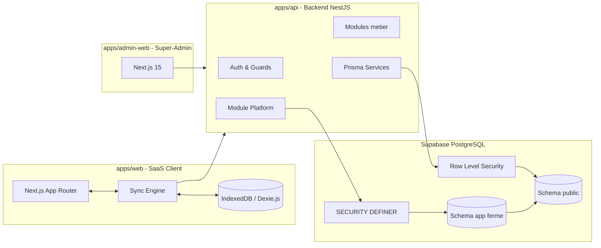
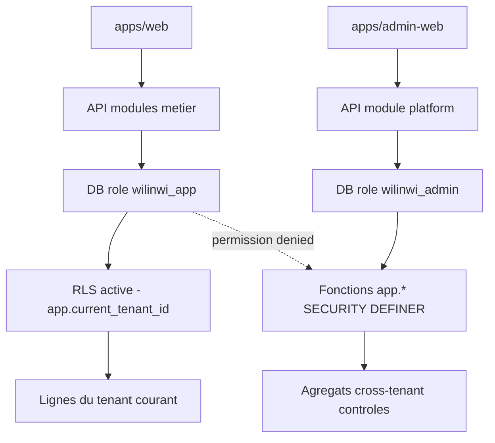
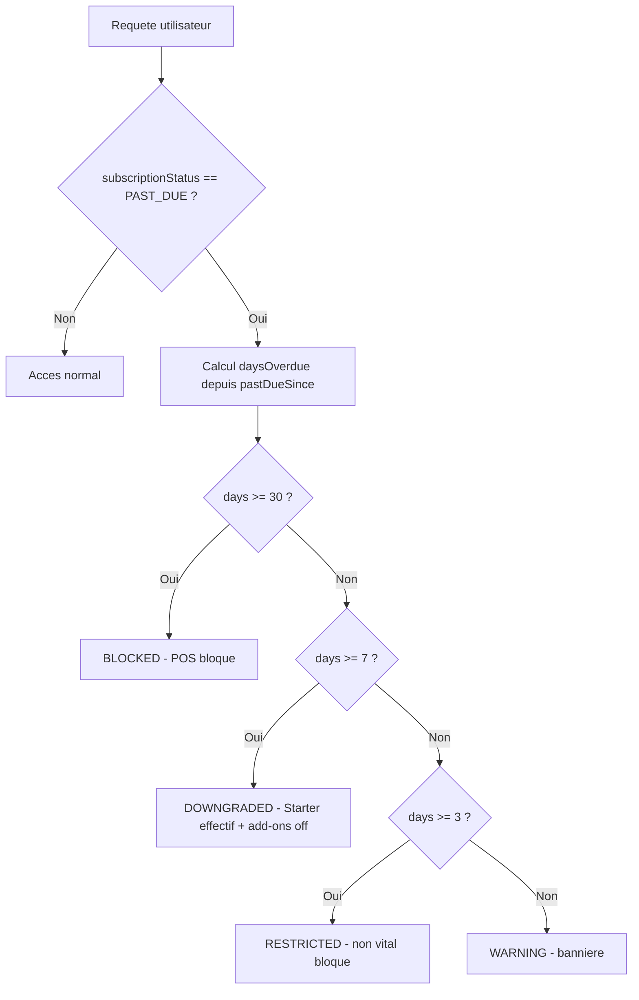
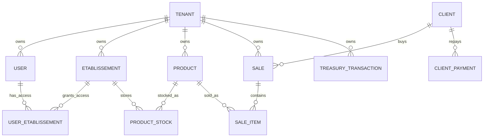
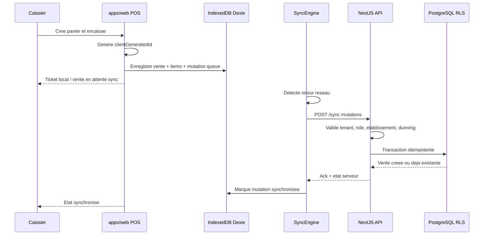

# Termes de Reference et Specifications Fonctionnelles & Techniques - Projet Wilinwi

> **Projet** : Wilinwi  
> **Positionnement** : Systeme d'exploitation du commerce pour les PME d'Afrique de l'Ouest  
> **Nature** : SaaS multi-tenant, offline-first, POS, stock, tresorerie, CRM, marketing, IA et console plateforme  
> **Version du document** : 1.0  
> **Date** : 04 juillet 2026  
> **Statut** : Document de reference projet  
> **Profondeur** : Complete  

---

## Sommaire

1. [Contexte et vision du projet](#1-contexte-et-vision-du-projet)  
2. [Architecture technique et choix technologiques](#2-architecture-technique-et-choix-technologiques)  
3. [Specifications des modules et fonctionnalites](#3-specifications-des-modules-et-fonctionnalites)  
4. [Logique de relance des impayes - Dunning progressif](#4-logique-de-relance-des-impayes---dunning-progressif)  
5. [Modele et schema de donnees - Prisma](#5-modele-et-schema-de-donnees---prisma)  
6. [Flux de donnees et synchronisation offline-first](#6-flux-de-donnees-et-synchronisation-offline-first)  
7. [Securite, isolation tenant et gouvernance des acces](#7-securite-isolation-tenant-et-gouvernance-des-acces)  
8. [Exigences non fonctionnelles](#8-exigences-non-fonctionnelles)  
9. [Criteres d'acceptation globaux](#9-criteres-dacceptation-globaux)  
10. [Hypotheses, risques et points de validation](#10-hypotheses-risques-et-points-de-validation)  
11. [Annexes - ADR structurants](#11-annexes---adr-structurants)

---

## 1. Contexte et vision du projet

### 1.1 Presentation generale

Wilinwi est une plateforme SaaS multi-tenant destinee aux PME, commercants, boutiques, pharmacies, supermarches, restaurants et reseaux de points de vente d'Afrique de l'Ouest. Sa promesse est de devenir le **systeme d'exploitation du commerce africain** : un outil central pour vendre, gerer les stocks, suivre la tresorerie, administrer les equipes, relancer les clients, piloter plusieurs etablissements et exploiter la plateforme a l'echelle.

Le produit est structure autour de deux surfaces principales :

- **Wilinwi Web Client** : application metier utilisee par les proprietaires, gerants, vendeurs, caissiers et livreurs.
- **Wilinwi Plateforme / Super-Admin** : console d'exploitation separee permettant a Nexus Partners de superviser les tenants, les plans, les abonnements, les modules premium, la facturation et les indicateurs globaux.

Wilinwi n'est pas seulement un logiciel de caisse. Il couvre le cycle operationnel complet d'une PME commerciale :

- catalogue produits et prix ;
- ventes et tickets ;
- stock par etablissement ;
- entrepot et dispatch ;
- tresorerie et depenses ;
- credit client et ardoises ;
- relances WhatsApp ;
- pilotage multi-boutiques ;
- facturation SaaS et supervision plateforme.

### 1.2 Problemes adresses

#### Connectivite instable ou intermittente

Dans de nombreux contextes d'usage, les points de vente ne disposent pas d'une connexion internet stable. Wilinwi doit donc permettre de vendre, consulter le catalogue, gerer le panier, imprimer ou afficher un ticket et enregistrer des operations critiques en mode deconnecte.

Le principe retenu est **offline-first** :

- l'application client conserve une base locale IndexedDB via Dexie.js ;
- les ventes et operations compatibles offline sont journalisees localement ;
- une synchronisation bidirectionnelle avec l'API est declenchee lors du retour reseau ;
- l'idempotence est garantie par des identifiants generes cote client ;
- les conflits sont detectes, journalises et resolus selon des regles metier explicites.

#### Absence de centimes dans les devises locales

Les montants en FCFA/XOF sont manipules comme des **entiers**. Aucun montant monetaire operationnel ne doit etre stocke sous forme de nombre decimal flottant.

Regle d'implementation :

- `1000` signifie 1 000 FCFA ;
- pas de centimes ;
- pas de `Float`, `Decimal` ou arrondi implicite pour les montants metier courants ;
- les totaux de vente, paiements, depenses, dettes, prix et soldes sont des `Int`.

#### Faible bancarisation et poids du Mobile Money

Le paiement en Afrique de l'Ouest repose fortement sur :

- les especes ;
- Mobile Money ;
- les virements ;
- les credits clients et paiements partiels.

Wilinwi doit integrer ces usages comme des flux natifs et non comme des exceptions. Les methodes de paiement supportees couvrent la caisse, le Mobile Money, le virement bancaire, le credit et l'acompte.

### 1.3 Objectifs du projet

Les objectifs principaux sont les suivants :

1. **Rendre la gestion de boutique ultra-simple**  
   Les operations frequentes doivent etre rapides, lisibles et adaptees a des utilisateurs non techniques.

2. **Assurer une exploitation resiliente**  
   Le systeme doit rester utilisable pendant les coupures internet et synchroniser les donnees sans doublons lors de la reconnexion.

3. **Garantir l'isolation stricte des donnees**  
   Chaque tenant doit etre isole par conception via Row Level Security PostgreSQL et par les controles applicatifs.

4. **Piloter le SaaS comme une plateforme**  
   Nexus Partners doit pouvoir superviser les entreprises, plans, abonnements, impayes, add-ons et indicateurs globaux depuis une console dediee.

5. **Preparer l'extension produit**  
   L'architecture doit permettre l'ajout de modules premium : WhatsApp Marketing, IA, analytics avances, connecteurs de paiement, e-commerce Enterprise.

---

## 2. Architecture technique et choix technologiques

### 2.1 Vue d'ensemble

Wilinwi repose sur une architecture monorepo, modulaire et multi-applications :



### 2.2 Frontend client

Le frontend client est construit avec :

- **Next.js App Router** ;
- **React** ;
- **TailwindCSS** ;
- **Dexie.js** pour IndexedDB ;
- un moteur de synchronisation offline-first.

Responsabilites :

- interface POS et modules metier ;
- stockage local des donnees necessaires a l'exploitation offline ;
- journalisation des mutations locales ;
- synchronisation asynchrone avec l'API ;
- gestion du tenant, de l'etablissement courant et des droits utilisateur ;
- application des gates d'abonnement cote interface.

Contraintes :

- les actions vitales de caisse doivent rester utilisables offline quand les donnees locales sont disponibles ;
- les operations a risque cross-tenant, facturation plateforme ou administration globale ne doivent jamais etre livrees dans le frontend client ;
- les montants sont affiches en FCFA mais stockes comme entiers.

### 2.3 Frontend super-admin

La console super-admin est une application Next.js 15 separee : `apps/admin-web`.

Objectifs :

- separer physiquement et logiquement l'interface d'exploitation plateforme de l'application cliente ;
- eviter toute exposition de routes ou composants super-admin dans `apps/web` ;
- restreindre l'acces aux emails allowlistes et, en production, a un controle reseau additionnel.

Fonctionnalites principales :

- liste et recherche des tenants ;
- KPIs plateforme ;
- fiche entreprise ;
- gestion des plans et statuts ;
- enregistrement manuel de paiements ;
- execution du billing run ;
- activation/desactivation d'add-ons premium ;
- consultation d'audit cross-tenant.

### 2.4 Backend API

Le backend est un monolithe modulaire NestJS en TypeScript.

Modules cibles :

- `auth` : authentification, contexte utilisateur, tenant courant ;
- `etablissement` : multi-etablissements et acces ;
- `stock` / `inventory` / `warehouse` : catalogue, stock, inventaires, dispatch ;
- `pos` : caisse, ventes, tickets, retours, annulations ;
- `crm` : clients, creances, remboursements ;
- `treasury` : mouvements de caisse, depenses, transferts, clotures ;
- `analytics` : tableaux de bord et rapports ;
- `sync` : synchronisation offline-first ;
- `notifications` : alertes in-app ;
- `plans` : plans, limites, modules ;
- `platform` : operations super-admin cross-tenant.

Regles d'architecture :

- les modules metier standards utilisent le role applicatif soumis a RLS ;
- le module `platform` utilise un service Prisma separe connecte au role DB admin ;
- les operations cross-tenant ne passent jamais par des requetes ORM directes non controlees ;
- les mutations critiques sont idempotentes ;
- les controles RBAC sont appliques avant les ecritures metier.

### 2.5 Base de donnees et securite RLS

La base de donnees est PostgreSQL hebergee sur Supabase. Prisma est utilise comme ORM.

Exigences obligatoires :

- toutes les tables operationnelles liees a un tenant portent `tenant_id` ;
- la Row Level Security est activee sur les tables multi-tenant ;
- les policies s'appuient sur `app.current_tenant_id()` ;
- le role de connexion applicatif ne possede aucun privilege de bypass RLS ;
- les fonctions cross-tenant necessaires au super-admin sont exposees via des fonctions SQL `SECURITY DEFINER` dans le schema ferme `app`.

Modele de privilege :



### 2.6 Fonctions SQL securisees

Les fonctions `SECURITY DEFINER` doivent respecter les contraintes suivantes :

- etre declarees dans le schema `app`, non expose par PostgREST ;
- definir explicitement `search_path = public` ;
- fournir une surface minimale : pas de SQL dynamique inutile ;
- etre appelees uniquement par le role DB autorise ;
- faire l'objet d'un `REVOKE` explicite au role applicatif ;
- retourner uniquement les champs necessaires a l'operation plateforme.

Exemples de fonctions attendues :

- `app.platform_tenants_overview()` ;
- `app.platform_tenant_etablissements(p_tenant uuid)` ;
- `app.platform_metrics()` ;
- `app.platform_recent_activity(p_limit int)` ;
- `app.billing_run_overdue()` ;
- `app.billing_record_payment(p_tenant uuid)` ;
- `app.billing_set_plan(p_tenant uuid, p_plan text)` ;
- `app.billing_set_status(p_tenant uuid, p_status text)` ;
- `app.platform_set_tenant_modules(p_tenant uuid, p_modules text[])`.

---

## 3. Specifications des modules et fonctionnalites

### 3.1 Hub / Accueil

#### Fonction

Le Hub est le point d'entree operationnel de l'entreprise. Il fournit une vue d'ensemble immediate de l'activite et oriente l'utilisateur vers les actions prioritaires.

#### Cas d'usage

- consulter le chiffre d'affaires du jour ;
- voir les ventes recentes ;
- consulter les alertes de stock bas ;
- afficher une check-list d'activation apres onboarding ;
- choisir l'etablissement courant ;
- basculer entre une vue etablissement et une vue consolidee lorsque le role le permet.

#### Contraintes

- les donnees doivent etre filtrees par tenant et par etablissement courant ;
- la vue consolidee est reservee aux roles autorises, typiquement `OWNER` et certains `MANAGER` ;
- les ecritures doivent etre bloquees en mode "Tous les etablissements" si l'action exige un lieu physique ;
- les alertes liees au dunning doivent etre visibles aux administrateurs du tenant.

#### Criteres d'acceptation

- Un utilisateur non autorise ne voit pas les etablissements auxquels il n'a pas acces.
- Le changement d'etablissement recharge les donnees de ventes, stock, tresorerie et alertes.
- Les montants affiches sont coherents avec les transactions stockees comme entiers.

### 3.2 Caisse POS & Ventes

#### Fonction

Le module POS permet d'encaisser rapidement, de produire un ticket, de gerer les paiements, d'appliquer les regles de prix et d'enregistrer les ventes meme en cas de coupure reseau.

#### Cas d'usage

- rechercher un produit ;
- ajouter au panier ;
- modifier une quantite ;
- appliquer un prix reel de vente ;
- verifier le prix plancher ;
- encaisser en especes, Mobile Money, virement, credit ou paiement partiel ;
- generer un ticket avec code de recu ;
- enregistrer une vente offline ;
- synchroniser les ventes lors de la reconnexion ;
- annuler une vente ou gerer un retour selon droits.

#### Gestion du prix plancher

Wilinwi supporte une architecture a quatre prix :

- `prixAchat` : cout interne, sensible ;
- `prixPlancher` : seuil minimal de vente ;
- `prixCatalogue` : prix affiche ou recommande ;
- `prixReel` : prix applique sur la ligne de vente.

Regles :

- si `prixReel >= prixPlancher`, la vente est autorisee ;
- si `prixReel < prixPlancher`, la vente passe en `PENDING_APPROVAL` ou exige une autorisation selon configuration ;
- tout depassement sous plancher doit etre trace dans `PriceOverride` avec motif, demandeur, approbateur et statut.

#### Offline complet

Le POS doit fonctionner offline selon les limites suivantes :

- vente possible sur catalogue et stock local ;
- generation d'un `clientGeneratedId` unique ;
- enregistrement local dans IndexedDB ;
- file d'attente de synchronisation ;
- tentative de push lors du retour reseau ;
- traitement idempotent cote API ;
- restitution a l'utilisateur de l'etat : "enregistre localement", "en synchronisation", "synchronise", "conflit".

#### Contraintes

- une vente synchronisee deux fois ne doit pas creer de doublon ;
- le stock doit etre diminue dans l'etablissement vendeur ;
- les paiements a credit doivent alimenter la creance client ;
- les operations sous dunning `BLOCKED` sont interdites ;
- les ventes offline ne doivent pas bypasser les droits utilisateur ou les gates d'abonnement.

### 3.3 Gestion des Stocks & Entrepot

#### Fonction

Le module Stock gere le catalogue, les quantites par etablissement, les mouvements, les inventaires, les seuils d'alerte et les transferts entre emplacements.

#### Cas d'usage

- creer et modifier un produit ;
- definir SKU, categorie, photos, prix, seuils ;
- consulter le stock par boutique ;
- consulter le stock consolide ;
- recevoir de la marchandise en entrepot ;
- faire un inventaire physique ;
- ajuster les ecarts ;
- transferer des produits d'un entrepot vers une boutique ;
- recevoir des alertes de rupture.

#### Modele de stock

Le stock operationnel est porte par `ProductStock`, projection materialisee par couple :

- produit ;
- variante optionnelle ;
- etablissement.

Les mouvements historiques sont portes par `StockMovement`. Ils permettent l'audit, la reconstruction et l'analyse.

#### Transferts inter-etablissements

Le transfert est formalise par `DispatchOrder` :

1. creation en brouillon ;
2. ajout des lignes ;
3. validation ;
4. decrement source ;
5. increment destination ;
6. creation des mouvements de stock ;
7. journalisation.

#### Contraintes

- un transfert valide est irreversible fonctionnellement ; l'annulation doit passer par un transfert inverse ou un ajustement trace ;
- la source et la destination doivent appartenir au meme tenant ;
- les operations d'entrepot critiques peuvent etre desactivees offline si la coherence stock ne peut pas etre garantie ;
- les seuils d'alerte sont propres a chaque etablissement.

### 3.4 Tresorerie & Comptabilite - PAY

#### Fonction

Le module PAY suit les flux financiers operationnels : encaissements, depenses, remboursements, virements, ajustements et clotures.

#### Cas d'usage

- consulter les soldes par compte ;
- enregistrer une depense ;
- enregistrer un remboursement client ;
- effectuer un transfert entre caisse, Mobile Money et banque ;
- cloturer la caisse ;
- justifier un ecart de caisse ;
- suivre les creances et ardoises clients ;
- consulter les transactions par etablissement.

#### Comptes supportes

- `CAISSE` : especes ;
- `MOBILE_MONEY` : MoMo, Moov, Celtiis, Orange Money ou equivalent ;
- `BANQUE` : virements et comptes bancaires.

#### Contraintes

- tous les montants sont des entiers FCFA ;
- un mouvement porte un sens `IN` ou `OUT` et un montant positif ;
- les depenses doivent etre categorisees ;
- les droits de decaissement doivent etre controles finement ;
- les operations sensibles doivent etre journalisees.

### 3.5 WhatsApp Marketing - MARKET

#### Fonction

Le module MARKET facilite les relances et la fidelisation client via WhatsApp et notifications.

#### Cas d'usage

- relancer un client ayant une dette ;
- notifier une promotion ;
- remercier un client apres achat ;
- pre-remplir un message WhatsApp contextualise ;
- segmenter les clients selon historique d'achat, dette ou derniere visite ;
- programmer des campagnes simples.

#### Contraintes

- le consentement et la conformite locale doivent etre pris en compte avant tout envoi automatise ;
- le module est premium et peut etre inclus dans un plan ou active a la carte ;
- en dunning J+3, le module est considere non vital et doit etre bloque ;
- en dunning J+7, les add-ons premium sont neutralises.

### 3.6 Assistant IA - AI

#### Fonction

L'assistant IA a vocation a transformer les donnees operationnelles en recommandations actionnables.

#### Cas d'usage

- predire les produits a reapprovisionner ;
- detecter les produits dormants ;
- proposer des seuils de stock ;
- identifier les clients a relancer ;
- resumer les performances de la semaine ;
- detecter des anomalies de marge, stock ou caisse.

#### Contraintes

- le module AI ne doit pas contourner la RLS ;
- les sorties doivent etre explicables et rattachees aux donnees disponibles ;
- les donnees sensibles ne doivent pas etre exposees a un prestataire IA sans base contractuelle et parametrage explicite ;
- les recommandations IA ne remplacent pas les validations metier sur les operations critiques.

### 3.7 Console Super-Admin - Plateforme

#### Fonction

La console Plateforme est l'outil d'exploitation du SaaS par Nexus Partners. Elle supervise les tenants, leurs plans, leurs echeances, leurs modules, leurs impayes et les indicateurs globaux.

#### Cas d'usage

- lister les boutiques clientes ;
- rechercher une entreprise ;
- consulter les KPIs globaux : MRR, GMV 30 jours, tenants actifs, impayes, utilisateurs actifs ;
- consulter les etablissements d'un tenant ;
- changer le plan d'une entreprise ;
- suspendre ou reactiver un tenant ;
- enregistrer manuellement un paiement ;
- lancer la detection des impayes ;
- activer un module premium a la carte ;
- consulter l'audit cross-tenant.

#### Facturation

Le coeur de facturation doit etre independant du prestataire de paiement :

- `subscriptionDueDate` porte l'echeance ;
- `billingCycle` porte le cycle mensuel ou annuel ;
- `billing_run_overdue` marque les tenants echus comme `PAST_DUE` ;
- `billing_record_payment` regularise et reporte l'echeance ;
- un webhook de paiement futur doit appeler la meme logique que le paiement manuel.

#### Add-ons premium a la carte

Les modules premium activables individuellement sont portes par `Tenant.moduleAddons`.

Regles :

- l'add-on s'ajoute aux modules inclus dans le plan ;
- l'activation est immediate ;
- la desactivation est immediate ;
- les add-ons sont neutralises en dunning J+7 ;
- l'add-on ne doit pas permettre de depasser une restriction de securite.

---

## 4. Logique de relance des impayes - Dunning progressif

### 4.1 Principe

Le dunning Wilinwi repose sur une logique progressive derivee de `Tenant.pastDueSince`. Les effets d'usage ne necessitent pas de cron obligatoire : le systeme calcule l'etape courante a la lecture ou avant une action critique.

Un cron ou un bouton super-admin peut toutefois executer `billing_run_overdue()` pour marquer comme `PAST_DUE` les tenants dont l'echeance est depassee.

### 4.2 Etats de dunning

| Retard | Etape | Effet principal | Modules impactes | Caisse |
| --- | --- | --- | --- | --- |
| J+0 | `WARNING` | Bannieres d'alerte | Aucun blocage | Active |
| J+3 | `RESTRICTED` | Restriction non vitale | Analytics avances, exports, WhatsApp, IA | Active |
| J+7 | `DOWNGRADED` | Retrogradation Starter | 1 point de vente actif, add-ons neutralises | Active |
| J+30 | `BLOCKED` | Blocage total | Acces metier bloque | Bloquee |

### 4.3 Regles detaillees

#### J+3 - Restriction non vitale

Modules bloques :

- Analytics avances ;
- exports ;
- WhatsApp Marketing ;
- Assistant IA ;
- modules premium non essentiels.

Modules maintenus :

- caisse ;
- consultation minimale du catalogue ;
- regularisation ;
- acces a la page de paiement ;
- fonctions indispensables a la recuperation de service.

#### J+7 - Retrogradation Starter

Effets :

- plan effectif limite au niveau STARTER ;
- un seul point de vente actif ;
- desactivation logique des add-ons premium a la carte ;
- limitation des fonctionnalites selon quotas Starter ;
- masquage ou verrouillage non destructif des ressources hors quota.

Important : aucune donnee ne doit etre supprimee automatiquement. Les restrictions sont reversibles apres paiement.

#### J+30 - Blocage total

Effets :

- acces a la caisse bloque ;
- redirection vers l'ecran de regularisation ;
- maintien d'une surface minimale pour consulter l'impaye et payer ;
- reactivation immediate apres `billing_record_payment`.

### 4.4 Diagramme de decision



---

## 5. Modele et schema de donnees - Prisma

### 5.1 Conventions de modelisation

Regles transverses :

- tous les montants FCFA sont des `Int` ;
- les tables operationnelles portent `tenantId` ;
- les noms physiques PostgreSQL utilisent `snake_case` via `@map` et `@@map` ;
- les identifiants principaux sont des UUID ;
- les operations offline utilisent des identifiants client pour l'idempotence ;
- les donnees sensibles sont protegees par RBAC et RLS.

### 5.2 Enums principaux

```prisma
enum Role {
  OWNER
  MANAGER
  SELLER
  CASHIER
  DELIVERY
}

enum Plan {
  STARTER
  PRO
  BUSINESS
  ENTERPRISE
}

enum BillingCycle {
  MONTHLY
  YEARLY
}

enum SubscriptionStatus {
  ACTIVE
  TRIALING
  PAST_DUE
  CANCELLED
}

enum EtablissementType {
  BOUTIQUE
  SUPERMARCHE
  PHARMACIE
  RESTAURANT
  ENTREPOT
  AGENCE
  BUREAU
  USINE
}

enum PaymentMethod {
  CASH
  MOBILE_MONEY
  BANK_TRANSFER
  CREDIT
  INSTALLMENT
}

enum SaleStatus {
  COMPLETED
  PENDING_PAYMENT
  PENDING_APPROVAL
  CANCELLED
}

enum CashAccount {
  CAISSE
  MOBILE_MONEY
  BANQUE
}

enum CashFlowType {
  IN
  OUT
}
```

### 5.3 Tenant - Boutique / Entreprise

```prisma
model Tenant {
  id                  String             @id @default(uuid()) @db.Uuid
  nom                 String
  pays                String?
  ville               String?
  plan                Plan               @default(STARTER)
  subscriptionStatus  SubscriptionStatus @default(TRIALING) @map("subscription_status")
  pastDueSince        DateTime?          @map("past_due_since")
  subscriptionDueDate DateTime?          @map("subscription_due_date")
  billingCycle        BillingCycle       @default(MONTHLY) @map("billing_cycle")
  moduleAddons        String[]           @default([]) @map("module_addons")
  internal            Boolean            @default(false)
  createdAt           DateTime           @default(now()) @map("created_at")
  updatedAt           DateTime           @updatedAt @map("updated_at")

  users               User[]
  etablissements      Etablissement[]
  userEtablissements  UserEtablissement[]
  products            Product[]
  productStocks       ProductStock[]
  sales               Sale[]
  cashMovements       TreasuryTransaction[]

  @@map("tenants")
}
```

### 5.4 Etablissement

```prisma
model Etablissement {
  id        String            @id @default(uuid()) @db.Uuid
  tenantId  String            @map("tenant_id") @db.Uuid
  nom       String
  type      EtablissementType @default(BOUTIQUE)
  ville     String?
  adresse   String?
  telephone String?
  actif     Boolean           @default(true)
  createdAt DateTime          @default(now()) @map("created_at")
  updatedAt DateTime          @updatedAt @map("updated_at")

  tenant     Tenant              @relation(fields: [tenantId], references: [id], onDelete: Cascade)
  userAccess UserEtablissement[]
  sales      Sale[]
  stocks     ProductStock[]

  @@index([tenantId])
  @@map("etablissements")
}
```

### 5.5 User

```prisma
model User {
  id                String   @id @db.Uuid
  tenantId          String   @map("tenant_id") @db.Uuid
  nom               String
  email             String
  role              Role     @default(SELLER)
  actif             Boolean  @default(true)
  poste             String?
  pinCode           String?  @map("pin_code")
  customPermissions Boolean  @default(false) @map("custom_permissions")
  permissions       String[] @default([])
  createdAt         DateTime @default(now()) @map("created_at")

  tenant            Tenant   @relation(fields: [tenantId], references: [id], onDelete: Cascade)
  etablissements    UserEtablissement[]
  ventesEffectuees  Sale[]   @relation("VendeurVentes")

  @@unique([tenantId, email])
  @@index([tenantId])
  @@map("users")
}
```

### 5.6 UserEtablissement

```prisma
model UserEtablissement {
  id              String   @id @default(uuid()) @db.Uuid
  tenantId        String   @map("tenant_id") @db.Uuid
  userId          String   @map("user_id") @db.Uuid
  etablissementId String   @map("etablissement_id") @db.Uuid
  createdAt       DateTime @default(now()) @map("created_at")

  tenant          Tenant        @relation(fields: [tenantId], references: [id], onDelete: Cascade)
  user            User          @relation(fields: [userId], references: [id], onDelete: Cascade)
  etablissement   Etablissement @relation(fields: [etablissementId], references: [id], onDelete: Cascade)

  @@unique([userId, etablissementId])
  @@index([tenantId])
  @@index([etablissementId])
  @@map("user_etablissements")
}
```

### 5.7 Product

```prisma
model Product {
  id            String   @id @default(uuid()) @db.Uuid
  tenantId      String   @map("tenant_id") @db.Uuid
  nom           String
  sku           String?
  categorie     String?
  photos        String[] @default([])
  prixAchat     Int      @map("prix_achat")
  prixPlancher  Int      @map("prix_plancher")
  prixCatalogue Int      @map("prix_catalogue")
  stock         Int      @default(0)
  seuilAlerte   Int      @default(5) @map("seuil_alerte")
  actif         Boolean  @default(true)
  createdAt     DateTime @default(now()) @map("created_at")
  updatedAt     DateTime @updatedAt @map("updated_at")

  tenant        Tenant         @relation(fields: [tenantId], references: [id], onDelete: Cascade)
  stocks        ProductStock[]
  saleItems     SaleItem[]

  @@unique([tenantId, sku])
  @@index([tenantId])
  @@map("products")
}
```

### 5.8 Stock et mouvements

```prisma
model ProductStock {
  id              String   @id @default(uuid()) @db.Uuid
  tenantId        String   @map("tenant_id") @db.Uuid
  productId       String   @map("product_id") @db.Uuid
  variantId       String?  @map("variant_id") @db.Uuid
  etablissementId String   @map("etablissement_id") @db.Uuid
  quantite        Int      @default(0)
  quantiteMin     Int      @default(0) @map("quantite_min")
  updatedAt       DateTime @updatedAt @map("updated_at")

  tenant          Tenant        @relation(fields: [tenantId], references: [id], onDelete: Cascade)
  product         Product       @relation(fields: [productId], references: [id], onDelete: Cascade)
  etablissement   Etablissement @relation(fields: [etablissementId], references: [id], onDelete: Cascade)

  @@index([tenantId])
  @@index([etablissementId])
  @@index([productId])
  @@map("product_stock")
}

model StockMovement {
  id              String            @id @default(uuid()) @db.Uuid
  tenantId        String            @map("tenant_id") @db.Uuid
  etablissementId String?           @map("etablissement_id") @db.Uuid
  productId       String            @map("product_id") @db.Uuid
  variantId       String?           @map("variant_id") @db.Uuid
  type            StockMovementType
  quantite        Int
  motif           String
  saleId          String?           @map("sale_id") @db.Uuid
  createdAt       DateTime          @default(now()) @map("created_at")

  @@index([tenantId])
  @@index([productId])
  @@map("stock_movements")
}
```

### 5.9 Sale et SaleItem

```prisma
model Sale {
  id                String        @id @default(uuid()) @db.Uuid
  tenantId          String        @map("tenant_id") @db.Uuid
  etablissementId   String?       @map("etablissement_id") @db.Uuid
  vendeurId         String        @map("vendeur_id") @db.Uuid
  clientId          String?       @map("client_id") @db.Uuid
  status            SaleStatus    @default(COMPLETED)
  paymentMethod     PaymentMethod @map("payment_method")
  total             Int
  montantVerse      Int           @default(0) @map("montant_verse")
  montantEspeces    Int           @default(0) @map("montant_especes")
  clientGeneratedId String?       @map("client_generated_id")
  receiptCode       String?       @unique @map("receipt_code")
  createdAt         DateTime      @default(now()) @map("created_at")
  aLivrer           Boolean       @default(false) @map("a_livrer")
  livreurId         String?       @map("livreur_id") @db.Uuid
  adresseLivraison  String?       @map("adresse_livraison")
  livreLe           DateTime?     @map("livre_le")

  tenant            Tenant        @relation(fields: [tenantId], references: [id], onDelete: Cascade)
  etablissement     Etablissement? @relation(fields: [etablissementId], references: [id])
  vendeur           User          @relation("VendeurVentes", fields: [vendeurId], references: [id])
  items             SaleItem[]

  @@unique([tenantId, clientGeneratedId])
  @@index([tenantId])
  @@index([tenantId, createdAt])
  @@index([tenantId, etablissementId])
  @@map("sales")
}

model SaleItem {
  id                String  @id @default(uuid()) @db.Uuid
  tenantId          String  @map("tenant_id") @db.Uuid
  saleId            String  @map("sale_id") @db.Uuid
  productId         String  @map("product_id") @db.Uuid
  variantId         String? @map("variant_id") @db.Uuid
  quantite          Int
  quantiteRetournee Int     @default(0) @map("quantite_retournee")
  prixReel          Int     @map("prix_reel")
  coutUnitaire      Int     @map("cout_unitaire")

  sale              Sale    @relation(fields: [saleId], references: [id], onDelete: Cascade)
  product           Product @relation(fields: [productId], references: [id])

  @@index([tenantId])
  @@index([saleId])
  @@map("sale_items")
}
```

### 5.10 TreasuryTransaction

Dans le schema actuel, l'entite technique correspondante est `CashMovement`. Pour les specifications fonctionnelles, elle est nommee `TreasuryTransaction` afin d'expliciter son role transverse.

```prisma
model TreasuryTransaction {
  id              String             @id @default(uuid()) @db.Uuid
  tenantId        String             @map("tenant_id") @db.Uuid
  etablissementId String?            @map("etablissement_id") @db.Uuid
  type            CashFlowType
  compte          CashAccount
  montant         Int
  source          CashMovementSource
  categorie       String?
  note            String?
  saleId          String?            @map("sale_id") @db.Uuid
  createdBy       String             @map("created_by") @db.Uuid
  createdAt       DateTime           @default(now()) @map("created_at")

  tenant          Tenant             @relation(fields: [tenantId], references: [id], onDelete: Cascade)
  etablissement   Etablissement?     @relation(fields: [etablissementId], references: [id])

  @@index([tenantId])
  @@index([tenantId, compte])
  @@index([tenantId, createdAt])
  @@index([tenantId, etablissementId])
  @@map("cash_movements")
}
```

### 5.11 Entites complementaires recommandees

Pour couvrir l'ensemble du produit, le modele doit egalement inclure :

- `Client` : dette client, plafond de credit, notes ;
- `ClientPayment` : remboursement et lettrage ;
- `SaleInstallment` : paiement partiel ;
- `PriceOverride` : vente sous prix plancher ;
- `Supplier` : fournisseur et dette fournisseur ;
- `PurchaseOrder` / `PurchaseOrderItem` : achat et reception ;
- `SupplierPayment` : paiement fournisseur ;
- `DispatchOrder` / `DispatchOrderItem` : transfert interne ;
- `Notification` : alertes stock, impaye, fournisseur ;
- `ActivityLog` : audit utilisateur et systeme ;
- `PlanConfig` : tarifs et limites de plan pilotables ;
- `PublicReceipt` : recu public non sensible.

### 5.12 Relations principales



---

## 6. Flux de donnees et synchronisation offline-first

### 6.1 Flux de vente offline



### 6.2 Regles d'idempotence

- Chaque vente offline porte `clientGeneratedId`.
- L'unicite est garantie par `@@unique([tenantId, clientGeneratedId])`.
- Le serveur doit retourner la vente existante si la mutation a deja ete traitee.
- Les mutations locales sont rejouables sans risque de doublon.

### 6.3 Synchronisation bidirectionnelle

Donnees descendantes :

- catalogue produits ;
- stocks par etablissement ;
- clients ;
- droits utilisateur ;
- configuration de plan ;
- etat d'abonnement ;
- seuils et notifications pertinentes.

Donnees montantes :

- ventes ;
- mouvements de caisse offline compatibles ;
- creations de clients ;
- paiements clients ;
- operations POS autorisees.

Operations a exclure ou restreindre offline :

- changements de plan ;
- operations super-admin ;
- dispatch critique si le stock source n'est pas fiable ;
- inventaire valide ;
- activation/desactivation d'utilisateurs ;
- operations de securite.

### 6.4 Gestion des conflits

| Type de conflit | Exemple | Strategie |
| --- | --- | --- |
| Vente deja synchronisee | retry reseau | Idempotence par `clientGeneratedId` |
| Stock insuffisant serveur | ventes concurrentes offline | Accepter avec alerte, ou mettre en conflit selon politique tenant |
| Produit archive serveur | vente offline sur produit ancien | Synchroniser avec trace et alerte manager |
| Prix modifie serveur | prix local obsolescent | Conserver prix reel de vente, journaliser |
| Droits retires | utilisateur vend offline apres retrait | Bloquer au push si revocation critique, sinon alerter |

---

## 7. Securite, isolation tenant et gouvernance des acces

### 7.1 Isolation tenant

Les controles d'isolation sont superposes :

1. **Contexte applicatif** : tenant resolu depuis l'utilisateur authentifie.
2. **RBAC** : role et permissions module.
3. **Acces etablissement** : restriction par `UserEtablissement`.
4. **RLS PostgreSQL** : enforcement final en base.
5. **Separation des roles DB** : `wilinwi_app` pour le metier, `wilinwi_admin` pour la plateforme.

### 7.2 RBAC

Roles standards :

- `OWNER` : controle complet du tenant ;
- `MANAGER` : pilotage operationnel delegue ;
- `SELLER` : ventes et consultation limitee ;
- `CASHIER` : caisse et encaissements ;
- `DELIVERY` : livraisons assignees.

Les permissions personnalisables permettent d'ajuster les capacites par module sans multiplier les roles.

### 7.3 Donnees sensibles

Donnees considerees sensibles :

- prix d'achat ;
- marge ;
- prix plancher ;
- soldes de caisse ;
- dettes clients ;
- dettes fournisseurs ;
- exports ;
- operations de plan et facturation.

Ces donnees doivent etre masquees ou interdites aux roles non autorises.

### 7.4 Audit

Les actions critiques doivent produire un `ActivityLog` :

- creation/annulation de vente ;
- vente sous prix plancher ;
- mouvement de stock ;
- ajustement inventaire ;
- decaissement ;
- creation ou modification utilisateur ;
- changement de plan ;
- activation/desactivation d'add-on ;
- operation super-admin.

---

## 8. Exigences non fonctionnelles

### 8.1 Performance

- POS utilisable sans latence perceptible sur operations courantes.
- Lecture stock par etablissement en O(1) via `ProductStock`.
- Index obligatoires sur `tenantId`, `createdAt`, `etablissementId` et relations frequentes.
- Agregats plateforme executes via fonctions SQL controlees.

### 8.2 Disponibilite et resilience

- Caisse utilisable offline sur donnees locales.
- Synchronisation tolerante aux retries.
- Aucune perte de vente locale sans signal explicite a l'utilisateur.
- Les actions non synchronisees restent visibles.

### 8.3 Maintenabilite

- Backend modulaire NestJS.
- Types partages lorsque possible.
- Fonctions pures pour la logique transversale de dunning.
- Decisions structurantes documentees sous forme d'ADR.

### 8.4 Observabilite

- Logs applicatifs structures cote API.
- Audit metier persistant.
- KPIs plateforme.
- Suivi des erreurs de synchronisation.
- Alertes recommandees sur impayes, erreurs API, echecs de sync et croissance DB.

### 8.5 Securite

- RLS obligatoire.
- Role Prisma applicatif sans bypass.
- Role admin separe pour les fonctions plateforme.
- Allowlist super-admin.
- Protection reseau recommandee pour `admin-web`.
- Hash du PIN utilisateur.
- Aucun secret dans le frontend.

---

## 9. Criteres d'acceptation globaux

### 9.1 Fonctionnels

- Un tenant ne peut lire ou modifier que ses propres donnees.
- Un utilisateur ne voit que les etablissements auxquels il a acces.
- Une vente offline peut etre creee, conservee localement et synchronisee sans doublon.
- Une vente sous prix plancher est detectee et tracee.
- Les stocks sont suivis par etablissement.
- Les transferts entre entrepot et boutique ajustent les deux emplacements.
- Les dettes clients et paiements partiels sont representes en FCFA entiers.
- Les modules premium peuvent etre actives a la carte par le super-admin.
- La logique J+3/J+7/J+30 s'applique sans suppression de donnees.

### 9.2 Techniques

- Toutes les tables operationnelles multi-tenant ont RLS activee.
- Les fonctions `app.*` cross-tenant sont inaccessibles au role applicatif.
- `apps/admin-web` est separe de `apps/web`.
- Les montants monetaires operationnels sont des entiers.
- Les operations offline critiques ont une cle d'idempotence.
- Les tests couvrent le dunning, l'isolation tenant, la creation de vente, le stock et la facturation plateforme.

### 9.3 Securite

- Le role `wilinwi_app` recoit `permission denied` sur les fonctions plateforme.
- Un utilisateur sans acces etablissement ne peut pas ecrire sur cet etablissement.
- Les donnees sensibles sont masquees aux roles non autorises.
- Les actions super-admin exigent allowlist applicative et role DB dedie.

---

## 10. Hypotheses, risques et points de validation

### 10.1 Hypotheses

- Le marche principal utilise le FCFA/XOF sans centimes.
- Les utilisateurs finaux peuvent partager des postes de caisse avec identification PIN.
- Supabase PostgreSQL reste la base transactionnelle principale.
- Le paiement en ligne sera ajoute via un prestataire externe, mais le coeur de facturation reste interne.
- Les modules WhatsApp et IA sont premium et soumis au gating d'abonnement.

### 10.2 Risques

| Risque | Impact | Mitigation |
| --- | --- | --- |
| Conflits de stock offline | Stock negatif ou incoherent | Politique de conflit explicite, alertes manager, audit |
| Mauvaise configuration RLS | Fuite inter-tenant | Tests d'isolation automatises, role sans bypass |
| Abus des fonctions super-admin | Acces cross-tenant non controle | Schema ferme, role dedie, allowlist, audit |
| Dependances paiement externe | Retard facturation automatique | Paiement manuel et coeur billing independants |
| UX offline mal comprise | Perte de confiance utilisateur | Etats de sync visibles et messages clairs |
| WhatsApp automatise non conforme | Risque legal ou reputationnel | Consentement, opt-out, limites d'envoi |

### 10.3 Zones de validation humaine

- Choix du prestataire de paiement : FedaPay, Wave, carte bancaire ou combinaison.
- Politique exacte de resolution des conflits stock offline.
- Niveau de restriction reseau pour `admin-web` en production.
- Regles commerciales des plans et quotas.
- Conditions legales d'envoi WhatsApp automatise.

---

## 11. Annexes - ADR structurants

### ADR-001 - FCFA stocke en entiers

**Decision** : tous les montants operationnels sont stockes en `Int`.  
**Raison** : le FCFA/XOF n'utilise pas de centimes dans les usages cibles ; les entiers eliminent les erreurs d'arrondi.  
**Consequence** : aucune operation monetaire metier ne doit utiliser de flottant.

### ADR-002 - Offline-first avec IndexedDB/Dexie.js

**Decision** : le frontend client utilise IndexedDB via Dexie.js pour la persistance locale et la file de synchronisation.  
**Raison** : garantir l'exploitation de la caisse pendant les coupures internet.  
**Consequence** : toutes les mutations offline doivent etre idempotentes et auditables.

### ADR-003 - RLS obligatoire pour le multi-tenant

**Decision** : la securite multi-tenant est appliquee en base via RLS.  
**Raison** : eviter qu'une erreur applicative expose les donnees d'un autre tenant.  
**Consequence** : toutes les tables operationnelles portent `tenant_id` et les roles DB sont separes.

### ADR-004 - Console super-admin separee

**Decision** : la console plateforme vit dans `apps/admin-web`, application distincte du SaaS client.  
**Raison** : reduire la surface d'exposition et separer clairement exploitation plateforme et usage client.  
**Consequence** : aucune route super-admin ne doit etre livree dans `apps/web`.

### ADR-005 - Cross-tenant via fonctions SECURITY DEFINER

**Decision** : les lectures et actions cross-tenant passent par des fonctions SQL `SECURITY DEFINER` dans le schema ferme `app`.  
**Raison** : permettre l'exploitation plateforme sans donner de bypass RLS au role applicatif.  
**Consequence** : le role `wilinwi_app` doit etre explicitement prive d'execution sur ces fonctions.

### ADR-006 - Dunning derive de pastDueSince

**Decision** : les restrictions d'impayes sont derivees de `pastDueSince`.  
**Raison** : rendre les effets deterministes sans dependance stricte a un cron.  
**Consequence** : le systeme peut appliquer les gates a la lecture ou avant chaque action critique.

---

## Prochaine action recommandee

Valider ce document comme reference projet, puis en extraire trois lots d'execution prioritaires : tests d'isolation RLS, durcissement de la synchronisation offline POS, et integration du prestataire de paiement retenu.
